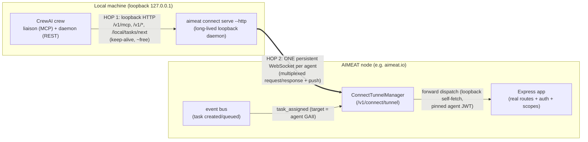
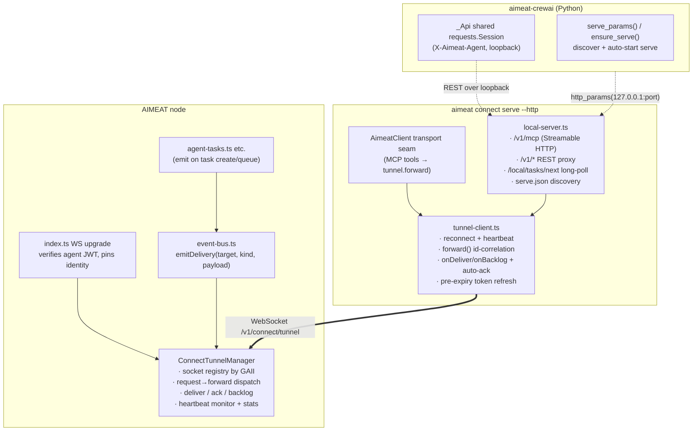
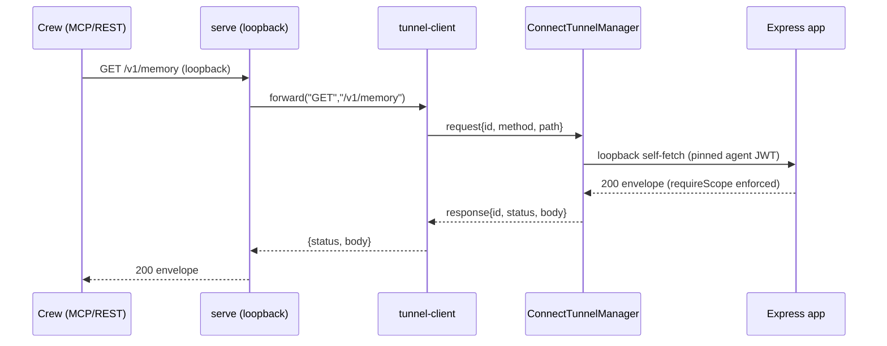
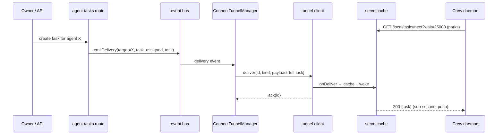
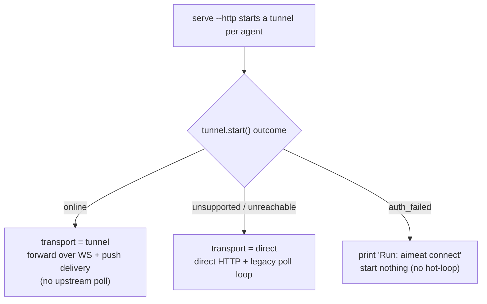

# Connector Forward Tunnel

How `aimeat connect serve` talks to an AIMEAT node over **one persistent
WebSocket per agent** — carrying forward API calls *and* realtime task delivery —
instead of a storm of short-lived HTTPS requests, and how local clients (CrewAI
crews, MCP runtimes) attach to it over loopback.

## Why this exists

Before the forward tunnel, two independent "socket storms" hit the node:

1. **Connector polling** — `aimeat connect serve` polled `/v1/agents/<a>/tasks`
   and `/inbox` every ~30s, each request with `Connection: close` → a fresh
   TCP+TLS handshake every time.
2. **CrewAI daemon** — `run_crew_daemon` bypassed the connector with bare
   `requests.get/post` (no shared session, new TLS per call), and in concurrent
   mode spawned **one `aimeat connect serve` subprocess per worker**.

The forward tunnel collapses all of that into **one upstream WebSocket per
agent**, multiplexed and id-correlated, with realtime server→agent push so there
is **no polling in the steady state** and **no subprocess churn**.

## The two hops



- **Hop 1 (local):** crews talk to `serve` over `127.0.0.1` — a local
  Streamable-HTTP MCP endpoint (`/v1/mcp`), a REST proxy (`/v1/*`), and a push
  long-poll (`/local/tasks/next`). Loopback keep-alive is effectively free.
- **Hop 2 (upstream):** `serve` holds **one** WebSocket per agent identity to the
  node and funnels everything through it.

## Components



## Frame protocol

The tunnel is full-duplex JSON frames, id-correlated where applicable.

| type | dir | payload |
|------|-----|---------|
| `welcome` | S→C | protocol version, heartbeat interval, request timeout, `token_expires_at`, reconnect hints |
| `heartbeat` / `heartbeat_ack` | both | liveness |
| `request` | C→S | `{ id, method, path, query?, headers?, body? }` |
| `response` | S→C | `{ id, status, body }` (AIMEAT envelope) |
| `deliver` | S→C | `{ id, kind, payload }` — **full** task object, realtime |
| `ack` | C→S | `{ id }` — in-session dedup (does **not** suppress backlog) |
| `backlog` | S→C | on-connect snapshot `{ tasks, messages }` from storage |
| `disconnect` | both | graceful close |
| `error` | S→C | `{ code, message }` — malformed/forbidden frame |

## Forward API call (agent → server)

Every MCP tool call and every daemon REST call becomes a `request` frame on the
one socket; the server runs it through the **real** Express stack so auth and
scope enforcement hold by construction.



Path safety: the server pins the resolved request origin to loopback, so a
protocol-relative path (`//evil/…`) can never make the node fetch an off-host
URL. Forwarded headers are allowlisted; `Authorization`/`Cookie`/`Host` are
stripped — the pinned JWT is the only credential.

## Realtime task delivery (server → agent, no polling)

When a task is created/queued for an agent, the node pushes the **full task**
down that agent's socket immediately; the crew picks it up via a loopback
long-poll that returns the instant it arrives.



## Reconnect + backlog = no loss

If the socket is down when a task is queued, nothing is lost: the task stays in
storage and is replayed on reconnect via a `backlog` snapshot. The backlog is
always computed from storage truth (queued + active), so an `ack` never causes a
task to be skipped — even if the agent acked then crashed mid-work.

```mermaid
sequenceDiagram
  participant Node as ConnectTunnelManager
  participant Store as storage
  participant Tun as tunnel-client

  Note over Tun,Node: socket drops (network blip / restart)
  Tun->>Node: reconnect (fresh token from keychain)
  Node->>Tun: welcome
  Node->>Store: list queued + active tasks, pending messages
  Store-->>Node: outstanding items
  Node->>Tun: backlog{tasks, messages}
  Note over Tun: dedup by id; a task leaves backlog only<br/>when its STATUS changes (done/failed)
```

## Graceful degradation

The tunnel is **opt-in** on the node (`AIMEAT_CONNECT_TUNNEL_ENABLED`, off by
default). If a node has it disabled or is too old, `serve` falls back
transparently — direct HTTP transport + the legacy poll loop — so crews keep
working.



## CrewAI integration

`aimeat-crewai` (≥ 0.4.0) attaches to the daemon via `serve_params()`, which
discovers a running `serve` (or auto-starts one) and returns loopback
`http_params`. The daemon's REST helpers share one `requests.Session` against the
loopback proxy, and the idle wait parks on `/local/tasks/next` when the tunnel is
live. `stdio_params` / `http_params` remain for one-shot / CI use. See
`docs/integrations/crewai.md`.

## Discovery file & operations

- **Endpoint:** `GET /v1/connect/tunnel?token=<agentJWT>` (WS upgrade; agent JWT,
  preferred via `Authorization` header). Opt-in via
  `AIMEAT_CONNECT_TUNNEL_ENABLED=true`.
- **Discovery file:** `<AIMEAT_HOME or ~/.aimeat>/serve.json` —
  `{ schema_version, port, pid, agents:[{agent, owner, node_url, transport}],
  started_at }`. Written atomically on start, removed on clean exit,
  stale-detected by pid (a live pid refuses a second daemon).
- **Local endpoints (loopback only):** `/v1/mcp` (Streamable HTTP MCP, no auth —
  loopback is the trust boundary), `/v1/*` (REST proxy; agent via
  `X-Aimeat-Agent` header or `?agent=`), `/local/tasks/next` (long-poll),
  `/local/status`, `POST /local/shutdown`.

## Security model

- The WS upgrade authenticates the **agent JWT** once; forward `request`s run
  through the real `requireAuth`/`requireScope` middleware, so the tunnel grants
  no privilege the agent didn't already have.
- Forward dispatch is **loopback-origin-pinned** (no SSRF) with an HTTP-method
  allowlist and a header allowlist; the WS frame size is capped.
- The local `serve` surface binds **127.0.0.1 only**; the daemon holds the token,
  so local clients never handle credentials.
- The forward bearer is the pinned JWT (no server-side expiry close — ~90-day
  agent JWTs overflow a single timer); the client reconnects with a fresh token
  before `token_expires_at`.

## Source map

| Concern | File |
|---|---|
| Server tunnel manager | `aimeat/src/services/connect-tunnel.ts` |
| WS upgrade + auth | `aimeat/src/index.ts` |
| Agent-scoped push | `aimeat/src/services/event-bus.ts`, `aimeat/src/routes/agent-tasks.ts` |
| Node tunnel client | `aimeat/src/cli/connect/tunnel-client.ts` |
| Transport seam | `aimeat/src/cli/connect/api-client.ts` |
| Loopback daemon | `aimeat/src/cli/connect/mcp/local-server.ts` |
| Python integration | `python/aimeat-crewai/src/aimeat_crewai/mcp_client.py`, `daemon.py` |
| Design + phases | `docs/plans/2026-06-10-connector-forward-tunnel.md` |
