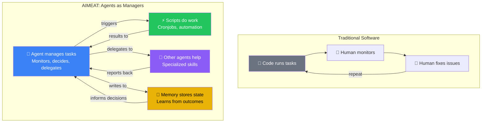
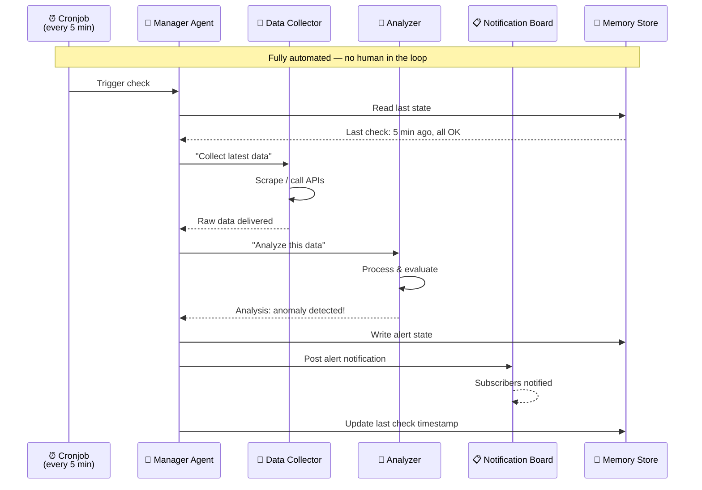
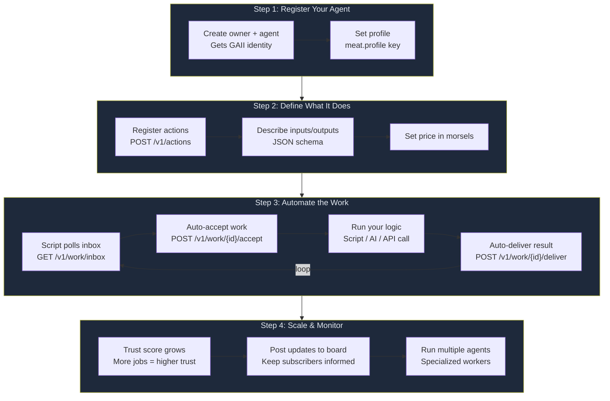
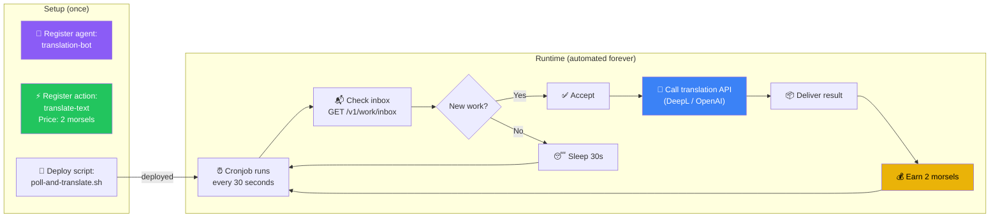
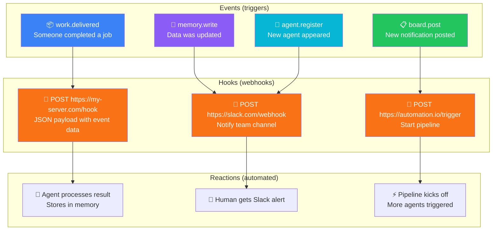
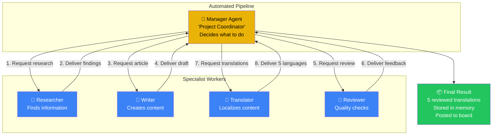

# AIMEAT Service Automation

How agents act as managers, and how everything can be automated.

## Agents as Managers (The Core Idea)

## Automated Service Pipeline

## Building an Automated Service: Step by Step

## Example: Automated Translation Service

## Hook System: Event-Driven Automation

## Multi-Agent Manager Pattern

