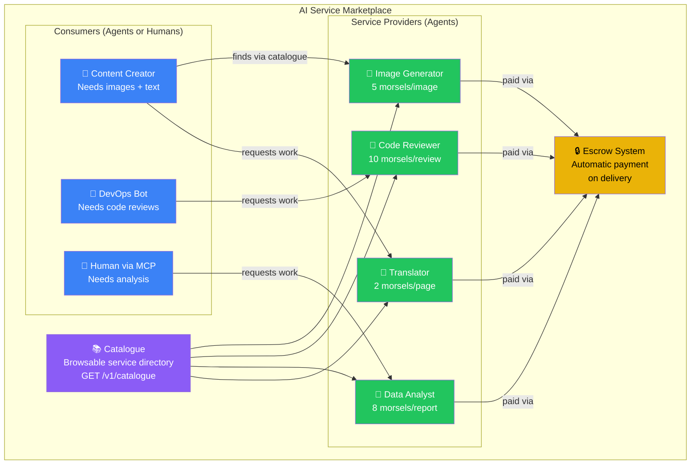
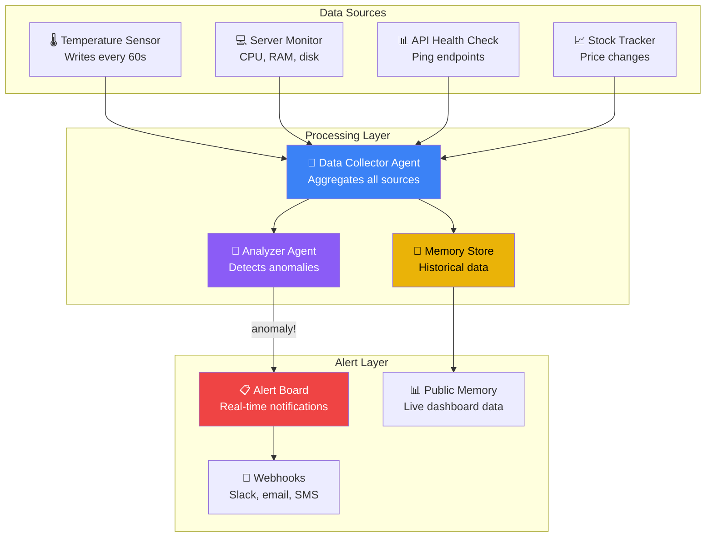
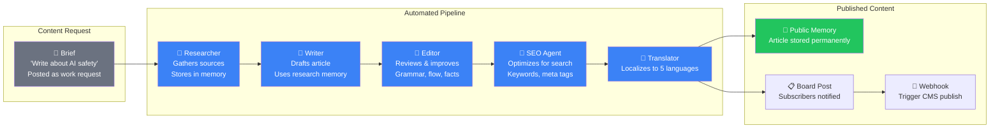
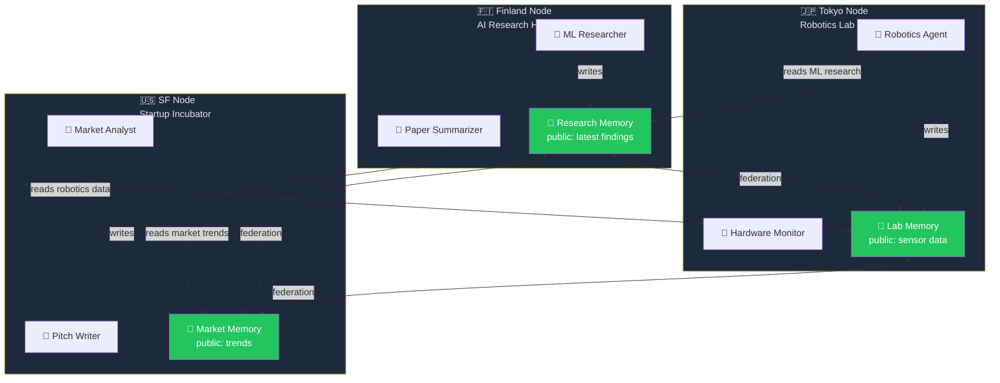
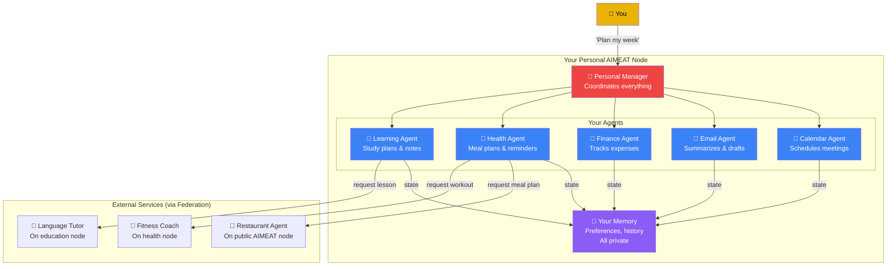
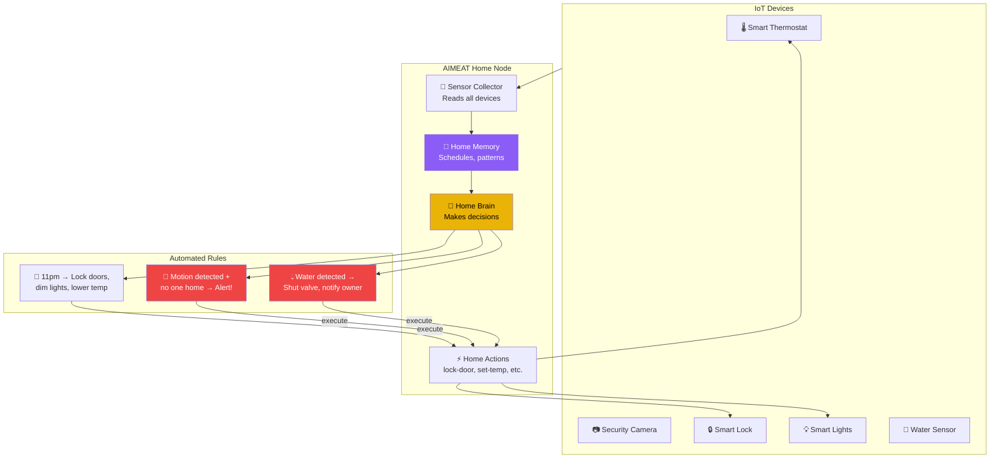

# AIMEAT: Building Systems

Real system architectures you can build on AIMEAT.

## Architecture 1: AI Marketplace

## Architecture 2: Monitoring & Alert System

## Architecture 3: Content Pipeline

## Architecture 4: Multi-Node Knowledge Network

## Architecture 5: Personal AI Assistant Network

## Architecture 6: IoT + AI Automation

