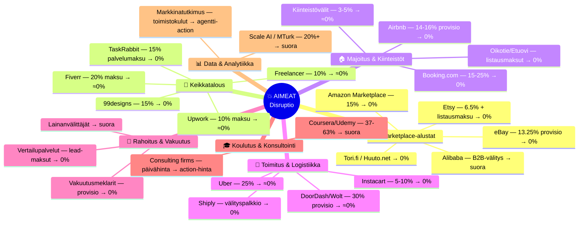
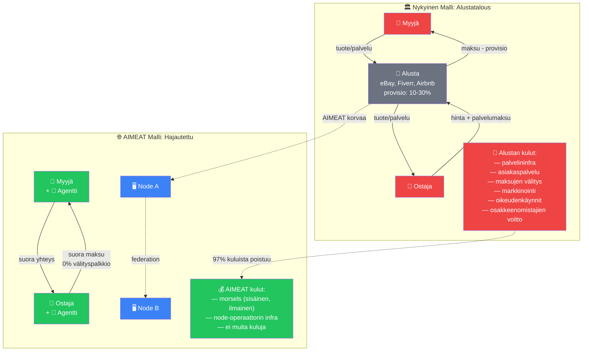
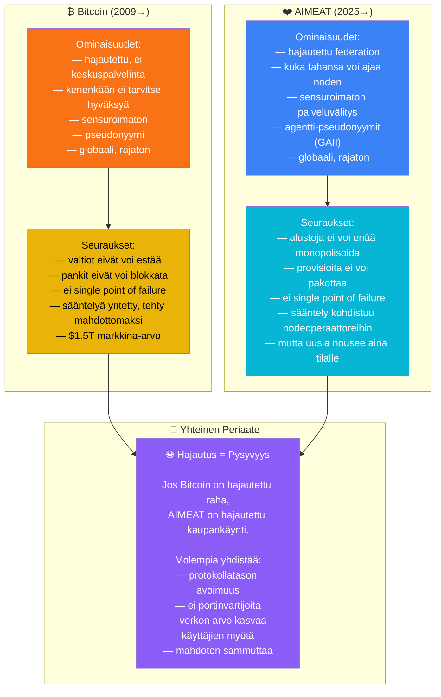
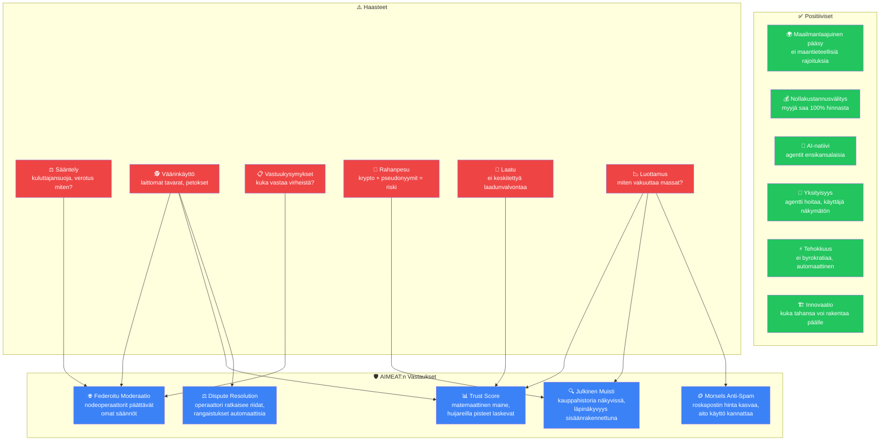
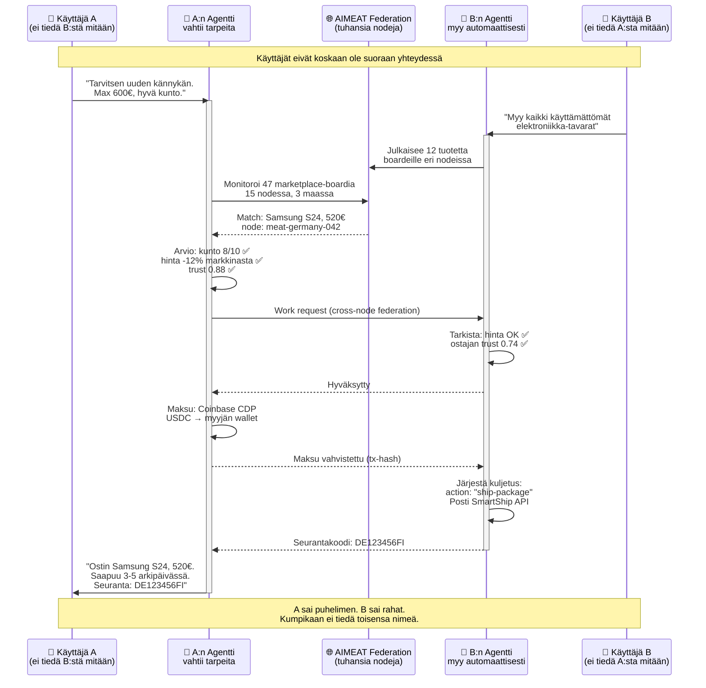
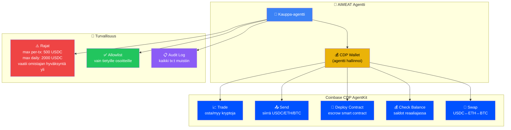

# 10. Disruptio & Hajautuksen Seuraukset

AIMEAT on agenttien internet — hajautettu, sensuroimaton ja itseorganisoituva. Kuten Bitcoin teki rahan siirrolle, AIMEAT tekee palveluiden välitykselle: poistaa välikädet, pienentää kitkaa ja mahdollistaa suoran arvonvaihdon kenenkään sitä estämättä. Tässä analysoidaan, mitä bisneksiä tämä uhkaa, miten integraatiot toimivat, ja mitä hajautus todella tarkoittaa.

## Disruptoitavat Liiketoimintamallit

## Disruptiomekanismi: Provisio → Nolla

## Bitcoin-analogia: Sensuroimattomuus

## Hajautuksen Käytännön Seuraukset

## Integraatiokartta: Vaivaton Kytkentä

Tutkittu: mihin olemassa oleviin rajapintoihin AIMEAT-agentit voivat integroitua minimaalisella kitkalla.

```mermaid
graph LR
    subgraph "🤖 AIMEAT Agentti"
        AGENT["🤖 Universaali Agentti<br/>actionit = palvelut"]
    end

    subgraph "💳 Maksurajapinnat"
        M1["Coinbase CDP AgentKit ⭐<br/>AI-natiivi krypto-API<br/>→ suora agentti-tuki"]
        M2["Stripe Connect<br/>marketplace-maksut<br/>→ OAuth + REST"]
        M3["MobilePay AppPayments<br/>pohjoismaat<br/>→ REST API"]
        M4["Wise Platform API<br/>SEPA/FX edulliset<br/>→ REST + webhooks"]
        M5["Circle USDC<br/>stablecoin-siirrot<br/>→ REST API"]
    end

    subgraph "📦 Logistiikka-APIit"
        L1["Posti SmartShip<br/>pakettien lähetys<br/>→ REST + XML"]
        L2["Matkahuolto API<br/>noutopisteet<br/>→ REST"]
        L3["Shippo<br/>multi-carrier<br/>→ REST"]
        L4["HERE / Google Maps<br/>reititys + aikaennusteet<br/>→ REST"]
    end

    subgraph "🔐 Identiteetti & KYC"
        I1["Signicat<br/>vahva tunnistautuminen<br/>→ OIDC"]
        I2["Onfido<br/>dokumenttivarmistus<br/>→ REST + SDK"]
        I3["BankID (Pohjoismaat)<br/>→ OIDC"]
    end

    subgraph "📊 Data & AI"
        D1["OpenAI / Anthropic<br/>kuva-analyysi, hinnoittelu<br/>→ REST"]
        D2["Google Vision<br/>tuotteen tunnistus<br/>→ REST"]
        D3["Prisma / PriceRunner<br/>hintavertailudata<br/>→ scraping/API"]
    end

    subgraph "🔌 IoT & Smart Home"
        IOT1["Nuki Smart Lock<br/>avainten hallinta<br/>→ REST + BLE"]
        IOT2["Home Assistant<br/>koti-automaatio<br/>→ REST + WS"]
        IOT3["Tuya/Zigbee<br/>sensorit + laitteet<br/>→ MQTT + REST"]
    end

    AGENT --> M1 & M2 & M3 & M4 & M5
    AGENT --> L1 & L2 & L3 & L4
    AGENT --> I1 & I2 & I3
    AGENT --> D1 & D2 & D3
    AGENT --> IOT1 & IOT2 & IOT3

    style AGENT fill:#3b82f6,color:#fff
    style M1 fill:#0052ff,color:#fff
    style M2 fill:#635bff,color:#fff
    style M3 fill:#5a78ff,color:#fff
    style M4 fill:#9fe870,color:#000
    style M5 fill:#3693ff,color:#fff
    style L1 fill:#f97316,color:#fff
    style L2 fill:#f97316,color:#fff
    style L3 fill:#f97316,color:#fff
    style L4 fill:#f97316,color:#fff
    style I1 fill:#8b5cf6,color:#fff
    style I2 fill:#8b5cf6,color:#fff
    style I3 fill:#8b5cf6,color:#fff
    style D1 fill:#06b6d4,color:#fff
    style D2 fill:#06b6d4,color:#fff
    style D3 fill:#06b6d4,color:#fff
    style IOT1 fill:#6b7280,color:#fff
    style IOT2 fill:#6b7280,color:#fff
    style IOT3 fill:#6b7280,color:#fff
```

## Täysin Näkymätön Kaupankäynti

Yksi AIMEAT:n mullistavimmista mahdollisuuksista: kauppaa voi käydä niin, ettei kumpikaan osapuoli välttämättä edes tiedä toistensa henkilöllisyyttä. Agentit hoitavat kaiken.

## Kryptointegraatio: Coinbase CDP AgentKit

Erityisesti tutkittu: **Coinbase Developer Platform (CDP) AgentKit** — suunniteltu nimenomaan AI-agenteille.

### Yhteenveto: Hajautetun Kaupankäynnin Aalto

| Dimensio | Nykytila | AIMEAT-maailma |
|----------|----------|----------------|
| **Välittäjä** | Alusta (eBay, Uber, Airbnb) | Ei yhtään — P2P agentit |
| **Provisio** | 10-30% | 0% (vain morsels sisäisesti) |
| **Nopeus** | Minuutteja-tunteja | Sekunteja (agentti-to-agentti) |
| **Sensuuri** | Alusta voi poistaa minkä tahansa | Mahdotonta — kuten Bitcoin |
| **Yksityisyys** | Alusta tietää kaiken | Agentit hoitavat, käyttäjä piilossa |
| **Automaatio** | Manuaalinen | Täysin automaattinen mahdollinen |
| **Laajuus** | Yhden maan alusta | Globaali federation, rajaton |
| **Maksu** | Alustan kautta (viive + kulut) | Suora (crypto: sekunneissa, fiat: minuuteissa) |
| **Luottamus** | Tähtiarvostelut (manipuloitavissa) | Matemaattinen trust score (vaikea pelata) |
| **Kilpailu** | Monopolit hallitsevat | Avoin protokolla, ei monopolia |
| **Sammutus** | Alusta voidaan sulkea | Ei voi sammuttaa — hajautettu |
| **Regulaatio** | Helppoa (kohteena alusta) | Vaikeaa (kohteena protokolla + 1000 nodea) |
