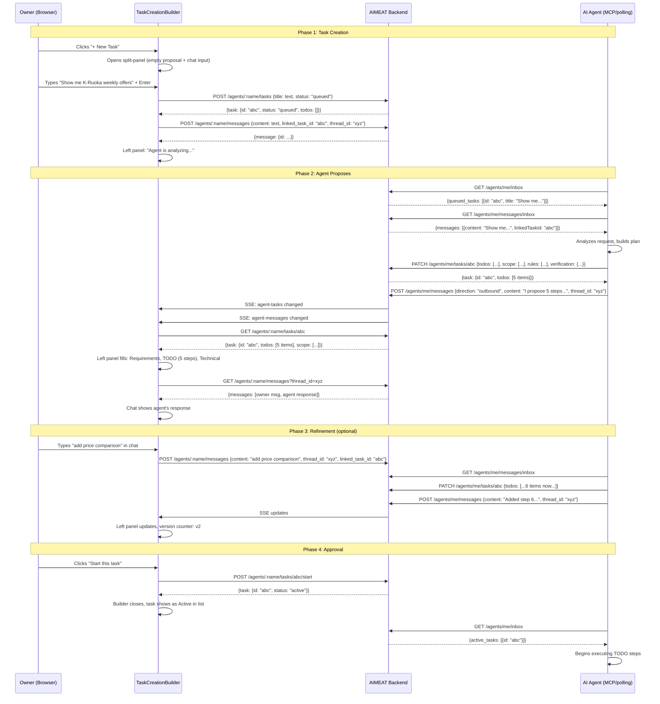

# Task Creation Builder Implementation Plan

> **For agentic workers:** REQUIRED SUB-SKILL: Use superpowers:subagent-driven-development (recommended) or superpowers:executing-plans to implement this plan task-by-task. Steps use checkbox (`- [ ]`) syntax for tracking.

**Goal:** Replace the inline task creation form with the design spec's split-panel Living Proposal builder that shows Requirements/TODO/Technical tabs on the left and a chat panel on the right.

**Architecture:** The builder creates a task (status: queued) from the user's first chat message, then shows a split-panel view. The left panel reads task data (auto-refreshes via SSE) as the agent PATCHes the task with its proposal. The right panel uses the existing agent messages system (linked via `linkedTaskId`) for owner-agent conversation about the task. No backend changes needed -- all required APIs already exist.

**Tech Stack:** Preact + HTM (no build step), existing CSS variable system, existing API services

---

## Sequence Diagram



---

## Gap Analysis

### Current State (what exists today)

**TaskCreateForm** (`agents-tasks-subtab.js:199-249`):
- Inline form with 3 fields: title input, description textarea, status dropdown (draft/queued)
- Creates task via `POST /v1/agents/:name/tasks`, closes form, returns to task list
- No proposal mechanism, no chat, no split-panel, no interaction with agent

**TaskItem** (`agents-tasks-subtab.js:43-196`):
- Expandable task row showing todo list, events, start/delete buttons
- Already renders TODO items with environment badges, progress tracking, timestamps
- Already has "Start this task" button guarded by `canStart = isQueued && hasTodos`

**agent-tasks.js** (frontend API service):
- Missing: `getTask()`, `appendEvent()` -- cannot fetch single task or send task events
- Has: `listTasks`, `createTask`, `startTask`, `completeTask`, `failTask`, `deleteTask`, `listEvents`

**agent-messages.js** (frontend API service):
- `sendMessage(agentName, content, threadId)` -- does NOT pass `linked_task_id`
- `listMessages(agentName, opts)` -- supports `threadId` filter
- Backend schema (`AgentMessageCreateSchema`) already accepts `linked_task_id` (Zod field present)

**Backend** (fully supports the design already):
- `POST /v1/agents/:name/tasks` -- only `title` is required; `status` defaults to `draft`
- `PATCH /v1/agents/:name/tasks/:id` -- agents can PATCH queued tasks (propose todos)
- `POST /v1/agents/:name/messages` -- accepts `linked_task_id`, `thread_id`
- `GET /v1/agents/:name/messages?thread_id=X` -- filters by thread
- SSE live updates work for both `agent-tasks` and `agent-messages` domains

### Target State (from design spec `docs/design/agent-dashboard-and-sharing-groups-spec.md`)

**Design spec lines 53-64 describe:**

Split-panel layout when creating a task:

**Left panel: Living Proposal** with three tabs:
- **Requirements** (default) -- "What I'll do" (plain language), Scope items, Rules, "When it works you'll see" (verification)
- **TODO** -- numbered steps with descriptions, time estimates, per-step verification, environment tags (AIMEAT green / agent env amber), summary
- **Technical** -- extension names, cron expressions, memory keys, verification checks (monospace), resources

**Right panel: Chat** -- user types naturally, agent responds and updates proposal, falls back to prompt-driven when agent is offline

**Bottom bar:** "Start this task" (primary) + "Save draft" (secondary)

### What Bridges the Gap

The backend already supports the full design. The gap is entirely frontend:

1. **API service** needs `getTask` and `linked_task_id` support on `sendMessage`
2. **TaskCreateForm** replaced by **TaskCreationBuilder** -- a split-panel component
3. Left panel reads task fields (`scope`, `rules`, `verification`, `todos`, `resources`) that auto-populate when agent PATCHes
4. Right panel uses existing messages system with `linkedTaskId` for task-scoped chat
5. Auto-refresh via SSE live updates (pattern already used in every other subtab)

### Task Lifecycle Through the Builder

```
User clicks "+ New Task"
  → Builder opens (split-panel: empty proposal + chat input)
  → User types request in chat ("Show me K-Ruoka weekly offers")
  → POST /tasks creates task (status: queued, title: user's text)
  → POST /messages sends message (linked_task_id: taskId, new threadId)
  → Left panel: "Agent is analyzing your request..."
  → Agent sees queued task in inbox, analyzes, PATCHes with todos/scope/rules
  → SSE update → left panel refreshes, shows proposal in 3 tabs
  → Agent sends message response in same thread
  → Chat panel shows response
  → User can refine via chat (agent PATCHes again)
  → When todos exist: "Start this task" button enables
  → User clicks Start → POST /start → builder closes → task active in list
```

---

## File Structure

### New Files
| File | Responsibility |
|------|---------------|
| `public/views/profile/agents-task-builder.js` | Split-panel builder: ProposalPanel (3 tabs) + ChatPanel + action buttons |

### Modified Files
| File | Changes |
|------|---------|
| `public/js/services/agent-tasks.js` | Add `getTask()` function |
| `public/js/services/agent-messages.js` | Add `linkedTaskId` param to `sendMessage()` |
| `public/views/profile/agents-tasks-subtab.js` | Import builder, add "building" state, show builder instead of TaskCreateForm |
| `public/css/views/agents-detail.css` | Split-panel layout, proposal tabs, builder-specific styles |
| `public/spa.html` | Add importmap entry for `agents-task-builder.js` |
| `locales/en.json` | Add builder i18n keys |
| `locales/fi.json` | Add builder i18n keys |

### Untouched Files (explicitly preserved)
- All backend routes (`agent-tasks.ts`, `agent-messages.ts`, `agent-integration.ts`)
- All storage layer code
- All MCP tools
- `TaskItem` component (stays as-is for viewing existing tasks)
- All Zod schemas (already support everything needed)

---

## Tasks

### Task 1: Extend API Services

**Files:**
- Modify: `aimeat/public/js/services/agent-tasks.js`
- Modify: `aimeat/public/js/services/agent-messages.js`

- [ ] **Step 1: Add `getTask` to agent-tasks.js**

Add this function after the existing `listTasks`:

```javascript
export async function getTask(agentName, taskId) {
  return apiGet(`/v1/agents/${encodeURIComponent(agentName)}/tasks/${encodeURIComponent(taskId)}`);
}
```

Note: this function already exists in the file (line 20-22). Verify it's there and skip if so.

- [ ] **Step 2: Add `linkedTaskId` param to `sendMessage` in agent-messages.js**

Current (line 10-16):
```javascript
export async function sendMessage(agentName, content, threadId) {
  return apiPost(`/v1/agents/${encodeURIComponent(agentName)}/messages`, {
    content,
    direction: 'inbound',
    ...(threadId && { thread_id: threadId }),
  });
}
```

Change to:
```javascript
export async function sendMessage(agentName, content, threadId, linkedTaskId) {
  return apiPost(`/v1/agents/${encodeURIComponent(agentName)}/messages`, {
    content,
    direction: 'inbound',
    ...(threadId && { thread_id: threadId }),
    ...(linkedTaskId && { linked_task_id: linkedTaskId }),
  });
}
```

- [ ] **Step 3: Update file header version**

agent-tasks.js: no change needed (getTask already exists).
agent-messages.js: update version-history to v1.1.0.

- [ ] **Step 4: Verify TypeScript compiles**

Run: `pnpm typecheck` from project root.
Expected: Clean compile (these are JS files, but verify no TS breakage).

---

### Task 2: i18n Keys

**Files:**
- Modify: `aimeat/locales/en.json`
- Modify: `aimeat/locales/fi.json`

- [ ] **Step 1: Add builder keys to en.json**

Find the `"profile" > "agents" > "tasks"` section (around line 368) and add these keys inside the `"tasks"` object:

```json
"builder": {
  "title": "New Task",
  "placeholder": "What should the agent do? Describe in plain language or technical detail.",
  "send": "Send to Agent",
  "analyzing": "Agent is analyzing your request...",
  "waitingTodos": "Waiting for agent to propose a plan...",
  "chatPlaceholder": "Refine the plan... (e.g. 'add price comparison', 'change schedule')",
  "startTask": "Start this task",
  "cancel": "Cancel",
  "tabRequirements": "Requirements",
  "tabTodo": "TODO",
  "tabTechnical": "Technical",
  "whatItDoes": "What it does",
  "scope": "Scope",
  "rules": "Rules",
  "verification": "When it works you'll see",
  "technicalChecks": "Technical checks",
  "extensions": "Extensions",
  "memoryKeys": "Memory keys",
  "cronSchedules": "Schedules",
  "resources": "Resources",
  "noDataYet": "Agent hasn't proposed this yet",
  "aimeatSteps": "AIMEAT steps",
  "agentSteps": "Agent env steps",
  "totalTime": "Estimated time",
  "version": "Proposal v{n}"
}
```

- [ ] **Step 2: Add matching keys to fi.json**

Same location in fi.json:

```json
"builder": {
  "title": "Uusi tehtävä",
  "placeholder": "Mitä agentin pitäisi tehdä? Kuvaile selkokielellä tai teknisesti.",
  "send": "Lähetä agentille",
  "analyzing": "Agentti analysoi pyyntöäsi...",
  "waitingTodos": "Odotetaan agentin suunnitelmaa...",
  "chatPlaceholder": "Tarkenna suunnitelmaa... (esim. 'lisää hintavertailu', 'vaihda aikataulu')",
  "startTask": "Käynnistä tehtävä",
  "cancel": "Peruuta",
  "tabRequirements": "Vaatimukset",
  "tabTodo": "TODO",
  "tabTechnical": "Tekninen",
  "whatItDoes": "Mitä se tekee",
  "scope": "Laajuus",
  "rules": "Säännöt",
  "verification": "Kun se toimii, näet",
  "technicalChecks": "Tekniset tarkistukset",
  "extensions": "Laajennukset",
  "memoryKeys": "Muistiavaimet",
  "cronSchedules": "Aikataulut",
  "resources": "Resurssit",
  "noDataYet": "Agentti ei ole vielä ehdottanut tätä",
  "aimeatSteps": "AIMEAT-vaiheet",
  "agentSteps": "Agenttiympäristö",
  "totalTime": "Arvioitu aika",
  "version": "Ehdotus v{n}"
}
```

- [ ] **Step 3: Verify both files have identical key structure**

Check that `en.json` and `fi.json` have the same keys under `profile.agents.tasks.builder`.

---

### Task 3: CSS Styles for the Builder

**Files:**
- Modify: `aimeat/public/css/views/agents-detail.css`

- [ ] **Step 1: Add split-panel layout styles**

Add after the existing `.agd-msg-thread-btn` styles (around line 568):

```css
/* ── Task Creation Builder ── */

.pf .agd-builder {
  border: 1px solid var(--border, #E5E7EB);
  border-radius: var(--radius, 8px);
  overflow: hidden;
  margin-top: 0.5rem;
}
.pf .agd-builder-header {
  display: flex;
  align-items: center;
  justify-content: space-between;
  padding: 0.5rem 0.75rem;
  border-bottom: 1px solid var(--border, #E5E7EB);
  background: var(--card-bg, #FFFFFF);
}
.pf .agd-builder-header h4 {
  margin: 0;
  font-size: 0.9rem;
  font-weight: 600;
}
.pf .agd-builder-panels {
  display: grid;
  grid-template-columns: 1fr 1fr;
  min-height: 350px;
}
@media (max-width: 768px) {
  .pf .agd-builder-panels {
    grid-template-columns: 1fr;
  }
}

/* Left panel: proposal */
.pf .agd-proposal {
  border-right: 1px solid var(--border, #E5E7EB);
  display: flex;
  flex-direction: column;
}
@media (max-width: 768px) {
  .pf .agd-proposal {
    border-right: none;
    border-bottom: 1px solid var(--border, #E5E7EB);
  }
}
.pf .agd-proposal-tabs {
  display: flex;
  border-bottom: 1px solid var(--border, #E5E7EB);
  background: var(--bg-dim, #F9FAFB);
}
.pf .agd-proposal-tab {
  flex: 1;
  padding: 0.4rem 0.5rem;
  background: none;
  border: none;
  border-bottom: 2px solid transparent;
  color: var(--text-dim, #6B7280);
  cursor: pointer;
  font-size: 0.78rem;
  font-weight: 500;
  text-align: center;
  transition: color 0.15s, border-color 0.15s;
}
.pf .agd-proposal-tab:hover { color: var(--text, #1A1A2E); }
.pf .agd-proposal-tab-active {
  color: var(--accent, #E8564A);
  border-bottom-color: var(--accent, #E8564A);
}
.pf .agd-proposal-content {
  flex: 1;
  overflow-y: auto;
  padding: 0.75rem;
  font-size: 0.82rem;
  max-height: 400px;
}

/* Proposal field sections */
.pf .agd-prop-section {
  margin-bottom: 0.75rem;
}
.pf .agd-prop-section:last-child { margin-bottom: 0; }
.pf .agd-prop-label {
  font-size: 0.7rem;
  font-weight: 600;
  text-transform: uppercase;
  letter-spacing: 0.5px;
  color: var(--text-dim, #6B7280);
  margin-bottom: 0.25rem;
}
.pf .agd-prop-value {
  color: var(--text, #1A1A2E);
  line-height: 1.5;
}
.pf .agd-prop-empty {
  color: var(--text-muted, #9CA3AF);
  font-style: italic;
  font-size: 0.8rem;
}
.pf .agd-prop-code {
  font-family: 'JetBrains Mono', monospace;
  font-size: 0.75rem;
  background: rgba(0, 0, 0, 0.04);
  padding: 2px 6px;
  border-radius: 3px;
}
.pf .agd-prop-list {
  list-style: none;
  padding: 0;
  margin: 0;
}
.pf .agd-prop-list li {
  padding: 0.15rem 0;
  border-bottom: 1px solid rgba(0, 0, 0, 0.04);
}
.pf .agd-prop-list li:last-child { border-bottom: none; }
.pf .agd-prop-check {
  display: flex;
  align-items: baseline;
  gap: 0.35rem;
}
.pf .agd-prop-check::before {
  content: '✓';
  color: var(--success, #10b981);
  font-weight: 600;
}
.pf .agd-scope-item {
  display: flex;
  align-items: baseline;
  gap: 0.5rem;
  padding: 0.2rem 0;
}
.pf .agd-scope-name {
  font-weight: 500;
  min-width: 80px;
}
.pf .agd-scope-type {
  font-size: 0.65rem;
  padding: 1px 5px;
  border-radius: 6px;
  background: var(--bg-dim, #F9FAFB);
  color: var(--text-dim, #6B7280);
}

/* Right panel: chat */
.pf .agd-builder-chat {
  display: flex;
  flex-direction: column;
  background: var(--card-bg, #FFFFFF);
}
.pf .agd-builder-chat-history {
  flex: 1;
  overflow-y: auto;
  padding: 0.5rem 0.75rem;
  display: flex;
  flex-direction: column;
  gap: 0.4rem;
  max-height: 350px;
}
.pf .agd-builder-chat-input {
  display: flex;
  gap: 0.5rem;
  padding: 0.5rem 0.75rem;
  border-top: 1px solid var(--border, #E5E7EB);
}
.pf .agd-builder-chat-input textarea {
  flex: 1;
  resize: none;
  border: 1px solid var(--border, #E5E7EB);
  border-radius: 8px;
  padding: 0.5rem 0.75rem;
  font-size: 0.82rem;
  min-height: 2.5rem;
  max-height: 5rem;
  font-family: inherit;
}
.pf .agd-builder-analyzing {
  display: flex;
  align-items: center;
  justify-content: center;
  padding: 2rem;
  color: var(--text-dim, #6B7280);
  font-size: 0.85rem;
  text-align: center;
}

/* Builder bottom bar */
.pf .agd-builder-actions {
  display: flex;
  justify-content: space-between;
  align-items: center;
  padding: 0.5rem 0.75rem;
  border-top: 1px solid var(--border, #E5E7EB);
  background: var(--bg-dim, #F9FAFB);
}
.pf .agd-builder-actions-right {
  display: flex;
  gap: 0.5rem;
}
.pf .agd-version-badge {
  font-size: 0.7rem;
  color: var(--text-muted, #9CA3AF);
}
```

- [ ] **Step 2: Update CSS file header version**

---

### Task 4: TaskCreationBuilder Component

**Files:**
- Create: `aimeat/public/views/profile/agents-task-builder.js`

This is the main component. It handles three states:
1. **initial** -- chat input only, waiting for user's first message
2. **proposing** -- split-panel, waiting for agent to propose
3. **reviewing** -- split-panel with proposal data, ready for start

- [ ] **Step 1: Create the builder component file**

```javascript
/**
 * @file agents-task-builder.js
 * @description Split-panel task creation builder with Living Proposal (3 tabs)
 *   and chat panel. Implements the design spec's conversational task creation flow:
 *   user describes what they want -> agent proposes plan -> user reviews and starts.
 * @structure
 *   - TaskCreationBuilder (default export) -- main split-panel component
 *   - ProposalPanel -- left panel with Requirements/TODO/Technical tabs
 *   - BuilderChat -- right panel with task-scoped messaging
 * @version-history
 *   v1.0.0 -- 2026-05-22 -- Initial creation per design spec Part 1
 */
import { h } from 'preact';
import { useState, useEffect, useRef } from 'preact/hooks';
import htm from 'htm';
const html = htm.bind(h);
import { t } from '/js/i18n.js';
import { timeAgo } from '/js/utils.js';
import { createTask, getTask, startTask } from '/js/services/agent-tasks.js';
import { sendMessage, listMessages } from '/js/services/agent-messages.js';

const PROPOSAL_TABS = ['requirements', 'todo', 'technical'];

function ProposalPanel({ task }) {
  const [activeTab, setActiveTab] = useState('requirements');

  if (!task) {
    return html`<div class="agd-builder-analyzing">${t('profile.agents.tasks.builder.analyzing')}</div>`;
  }

  const hasTodos = task.todos && task.todos.length > 0;
  const hasScope = task.scope && task.scope.length > 0;
  const hasRules = task.rules && task.rules.length > 0;
  const hasVerification = task.verification?.userExpects || (task.verification?.technicalChecks?.length > 0);
  const hasResources = task.resources && (
    task.resources.knowledgePackages?.length > 0 ||
    task.resources.memoryKeys?.length > 0 ||
    task.resources.memoryPrefixes?.length > 0
  );
  const hasProposal = hasTodos || hasScope || hasRules || hasVerification;

  const noData = html`<div class="agd-prop-empty">${t('profile.agents.tasks.builder.noDataYet')}</div>`;

  return html`
    <div class="agd-proposal">
      <div class="agd-proposal-tabs">
        ${PROPOSAL_TABS.map(tab => html`
          <button key=${tab}
            class="agd-proposal-tab ${activeTab === tab ? 'agd-proposal-tab-active' : ''}"
            onClick=${() => setActiveTab(tab)}>
            ${t(`profile.agents.tasks.builder.tab${tab.charAt(0).toUpperCase() + tab.slice(1)}`)}
          </button>
        `)}
      </div>

      <div class="agd-proposal-content">
        ${activeTab === 'requirements' && html`
          <div class="agd-prop-section">
            <div class="agd-prop-label">${t('profile.agents.tasks.builder.whatItDoes')}</div>
            <div class="agd-prop-value">${task.description || task.title}</div>
          </div>

          ${hasScope ? html`
            <div class="agd-prop-section">
              <div class="agd-prop-label">${t('profile.agents.tasks.builder.scope')}</div>
              ${task.scope.map(s => html`
                <div class="agd-scope-item" key=${s.name}>
                  <span class="agd-scope-name">${s.description || s.name}</span>
                  <span class="agd-prop-code">${s.value}</span>
                  <span class="agd-scope-type">${s.type}</span>
                </div>
              `)}
            </div>
          ` : ''}

          ${hasRules ? html`
            <div class="agd-prop-section">
              <div class="agd-prop-label">${t('profile.agents.tasks.builder.rules')}</div>
              <ul class="agd-prop-list">
                ${task.rules.map((r, i) => html`<li key=${i}>${r}</li>`)}
              </ul>
            </div>
          ` : ''}

          ${hasVerification ? html`
            <div class="agd-prop-section">
              <div class="agd-prop-label">${t('profile.agents.tasks.builder.verification')}</div>
              ${task.verification.userExpects && html`
                <div class="agd-prop-check">${task.verification.userExpects}</div>
              `}
              ${task.verification.technicalChecks?.map((c, i) => html`
                <div class="agd-prop-check" key=${i}><span class="agd-prop-code">${c}</span></div>
              `)}
            </div>
          ` : ''}

          ${!hasProposal && !hasTodos ? html`
            <div class="agd-builder-analyzing">${t('profile.agents.tasks.builder.waitingTodos')}</div>
          ` : ''}
        `}

        ${activeTab === 'todo' && html`
          ${hasTodos ? html`
            <div>
              <div class="agd-todo-header">
                <strong>TODO</strong>
                <span class="agd-todo-summary">
                  ${(() => {
                    const aimeatSteps = task.todos.filter(td => td.environment === 'aimeat').length;
                    const agentSteps = task.todos.filter(td => td.environment === 'agent').length;
                    const totalMinutes = task.todos.reduce((sum, td) => sum + (td.estimateMinutes || 0), 0);
                    return html`
                      ${aimeatSteps > 0 && html`<span class="agd-env-badge agd-env-aimeat">AIMEAT: ${aimeatSteps}</span>`}
                      ${agentSteps > 0 && html`<span class="agd-env-badge agd-env-agent">Agent: ${agentSteps}</span>`}
                      ${totalMinutes > 0 && html`<span class="agd-todo-time">~${totalMinutes} min</span>`}
                    `;
                  })()}
                </span>
              </div>
              <div class="agd-todo-list">
                ${task.todos.map((td, i) => html`
                  <div class="agd-todo-item agd-todo-${td.status || 'pending'}" key=${td.id || i}>
                    <span class="agd-todo-icon">${td.status === 'done' ? '✅' : '⬜'}</span>
                    <div class="agd-todo-content">
                      <div class="agd-todo-title">
                        <span>${i + 1}. ${td.title}</span>
                        <span class="agd-env-badge agd-env-${td.environment || 'agent'}">${(td.environment || 'agent').toUpperCase()}</span>
                        ${td.estimateMinutes && html`<span class="agd-todo-est">${td.estimateMinutes} min</span>`}
                      </div>
                      ${td.description && html`<div class="agd-todo-desc">${td.description}</div>`}
                      ${td.environmentReason && html`<div class="agd-todo-reason">${td.environmentReason}</div>`}
                      ${td.verification && html`<div class="agd-todo-verify">${td.verification}</div>`}
                    </div>
                  </div>
                `)}
              </div>
            </div>
          ` : html`
            <div class="agd-builder-analyzing">${t('profile.agents.tasks.builder.waitingTodos')}</div>
          `}
        `}

        ${activeTab === 'technical' && html`
          ${hasScope ? html`
            <div class="agd-prop-section">
              ${task.scope.filter(s => s.type === 'cron').length > 0 && html`
                <div class="agd-prop-label">${t('profile.agents.tasks.builder.cronSchedules')}</div>
                ${task.scope.filter(s => s.type === 'cron').map(s => html`
                  <div key=${s.name}><span class="agd-prop-code">${s.value}</span> -- ${s.name}</div>
                `)}
              `}
            </div>
          ` : ''}

          ${task.verification?.technicalChecks?.length > 0 ? html`
            <div class="agd-prop-section">
              <div class="agd-prop-label">${t('profile.agents.tasks.builder.technicalChecks')}</div>
              ${task.verification.technicalChecks.map((c, i) => html`
                <div key=${i} class="agd-prop-code" style="margin-bottom:0.25rem">${c}</div>
              `)}
            </div>
          ` : ''}

          ${hasResources ? html`
            <div class="agd-prop-section">
              <div class="agd-prop-label">${t('profile.agents.tasks.builder.resources')}</div>
              ${task.resources.memoryKeys?.map(k => html`
                <div key=${k}><span class="agd-prop-code">${k}</span></div>
              `)}
              ${task.resources.memoryPrefixes?.map(p => html`
                <div key=${p}><span class="agd-prop-code">${p}*</span></div>
              `)}
              ${task.resources.knowledgePackages?.map(p => html`
                <div key=${p}>📦 ${p}</div>
              `)}
            </div>
          ` : ''}

          ${!hasScope && !hasResources && !(task.verification?.technicalChecks?.length > 0) ? noData : ''}
        `}
      </div>
    </div>
  `;
}

function BuilderChat({ agentName, taskId, threadId, onTaskCreated, showToast }) {
  const [messages, setMessages] = useState([]);
  const [draft, setDraft] = useState('');
  const [sending, setSending] = useState(false);
  const historyRef = useRef(null);

  async function loadMessages() {
    if (!threadId) return;
    try {
      const res = await listMessages(agentName, { threadId });
      setMessages(res?.data?.messages || []);
    } catch {
      setMessages([]);
    }
  }

  useEffect(() => { loadMessages(); }, [threadId]);

  useEffect(() => {
    if (!threadId) return;
    const handler = () => loadMessages();
    window.addEventListener('aimeat-live-update', handler);
    return () => window.removeEventListener('aimeat-live-update', handler);
  }, [threadId]);

  useEffect(() => {
    if (historyRef.current) {
      historyRef.current.scrollTop = historyRef.current.scrollHeight;
    }
  }, [messages]);

  async function handleSend() {
    const text = draft.trim();
    if (!text) return;
    setSending(true);
    try {
      if (!taskId) {
        await onTaskCreated(text);
      } else {
        await sendMessage(agentName, text, threadId, taskId);
        setDraft('');
        await loadMessages();
      }
    } catch (err) {
      showToast(err.message || 'Failed to send', true);
    }
    setSending(false);
  }

  function handleKeyDown(e) {
    if (e.key === 'Enter' && !e.shiftKey) {
      e.preventDefault();
      handleSend();
    }
  }

  const sorted = [...messages].sort((a, b) => new Date(a.createdAt || 0) - new Date(b.createdAt || 0));
  const placeholder = taskId
    ? t('profile.agents.tasks.builder.chatPlaceholder')
    : t('profile.agents.tasks.builder.placeholder');

  return html`
    <div class="agd-builder-chat">
      <div class="agd-builder-chat-history" ref=${historyRef}>
        ${sorted.map(msg => {
          const isInbound = msg.direction === 'inbound';
          return html`
            <div key=${msg.id}>
              <div class="agd-msg-bubble ${isInbound ? 'agd-msg-inbound' : 'agd-msg-outbound'}">
                ${msg.content}
              </div>
              <div class="agd-msg-meta ${isInbound ? 'agd-msg-meta-right' : ''}">
                ${msg.createdAt ? html`<span class="agd-msg-time">${new Date(msg.createdAt).toLocaleTimeString([], { hour: '2-digit', minute: '2-digit' })}</span> ${timeAgo(msg.createdAt)}` : ''}
              </div>
            </div>
          `;
        })}
        ${taskId && messages.length === 0 && html`
          <div class="agd-builder-analyzing">${t('profile.agents.tasks.builder.analyzing')}</div>
        `}
      </div>
      <div class="agd-builder-chat-input">
        <textarea
          value=${draft}
          onInput=${(e) => setDraft(e.target.value)}
          onKeyDown=${handleKeyDown}
          placeholder=${placeholder}
          rows="1"
        />
        <button class="btn-primary btn-sm" onClick=${handleSend} disabled=${sending || !draft.trim()}>
          ${taskId ? t('profile.agents.messages.send') : t('profile.agents.tasks.builder.send')}
        </button>
      </div>
    </div>
  `;
}

export default function TaskCreationBuilder({ agentName, session, showToast, onClose }) {
  const [taskId, setTaskId] = useState(null);
  const [threadId, setThreadId] = useState(null);
  const [task, setTask] = useState(null);
  const [starting, setStarting] = useState(false);
  const [version, setVersion] = useState(0);

  async function loadTask() {
    if (!taskId) return;
    try {
      const resp = await getTask(agentName, taskId);
      const newTask = resp?.data?.task;
      if (newTask) {
        if (task && JSON.stringify(newTask.todos) !== JSON.stringify(task.todos)) {
          setVersion(v => v + 1);
        }
        setTask(newTask);
      }
    } catch { /* task may not exist yet */ }
  }

  useEffect(() => { loadTask(); }, [taskId]);

  useEffect(() => {
    if (!taskId) return;
    const handler = () => loadTask();
    window.addEventListener('aimeat-live-update', handler);
    return () => window.removeEventListener('aimeat-live-update', handler);
  }, [taskId]);

  async function handleFirstMessage(text) {
    const newThreadId = crypto.randomUUID();
    try {
      const resp = await createTask(agentName, { title: text, status: 'queued' });
      const newTaskId = resp?.data?.task?.id;
      if (!newTaskId) throw new Error('No task ID returned');
      setTaskId(newTaskId);
      setThreadId(newThreadId);
      await sendMessage(agentName, text, newThreadId, newTaskId);
    } catch (err) {
      showToast(err.message || 'Failed to create task', true);
    }
  }

  async function handleStart() {
    setStarting(true);
    try {
      await startTask(agentName, taskId);
      showToast(t('profile.agents.tasks.builder.startTask'));
      onClose();
    } catch (err) {
      showToast(err.message || 'Failed to start task', true);
    }
    setStarting(false);
  }

  const hasTodos = task?.todos?.length > 0;
  const canStart = hasTodos && (task?.status === 'queued' || task?.status === 'draft');

  return html`
    <div class="agd-builder">
      <div class="agd-builder-header">
        <h4>${t('profile.agents.tasks.builder.title')}</h4>
        ${version > 0 && html`<span class="agd-version-badge">${t('profile.agents.tasks.builder.version').replace('{n}', version)}</span>`}
      </div>

      <div class="agd-builder-panels">
        <${ProposalPanel} task=${task} />
        <${BuilderChat}
          agentName=${agentName}
          taskId=${taskId}
          threadId=${threadId}
          onTaskCreated=${handleFirstMessage}
          showToast=${showToast}
        />
      </div>

      <div class="agd-builder-actions">
        <div>
          ${canStart && html`
            <button class="btn-primary btn-sm" onClick=${handleStart} disabled=${starting}>
              ${starting ? '...' : t('profile.agents.tasks.builder.startTask')}
            </button>
          `}
        </div>
        <div class="agd-builder-actions-right">
          <button class="btn-outline btn-sm" onClick=${onClose}>${t('profile.agents.tasks.builder.cancel')}</button>
        </div>
      </div>
    </div>
  `;
}
```

- [ ] **Step 2: Verify the file renders without syntax errors**

Start dev server (`pnpm dev`) and open the agents tab. The component is not yet wired in, but verify no import errors in the browser console.

---

### Task 5: Wire Builder into AgentTasksSubtab

**Files:**
- Modify: `aimeat/public/views/profile/agents-tasks-subtab.js`

- [ ] **Step 1: Import the builder**

Add after the existing imports (line 21):

```javascript
import TaskCreationBuilder from './agents-task-builder.js';
```

- [ ] **Step 2: Replace the TaskCreateForm usage in AgentTasksSubtab**

In the `AgentTasksSubtab` component, change the rendering logic. The current code (lines 296-304) shows `TaskCreateForm` when `showCreate` is true. Replace with the builder:

Find:
```javascript
      ${showCreate && html`
        <${TaskCreateForm} agentName=${agentName} showToast=${showToast} onCreated=${handleCreated} onCancel=${() => setShowCreate(false)} />
      `}
```

Replace with:
```javascript
      ${showCreate && html`
        <${TaskCreationBuilder} agentName=${agentName} session=${session} showToast=${showToast} onClose=${handleCreated} />
      `}
```

Where `handleCreated` (line 278-281) already does `setShowCreate(false); loadTasks();` which is exactly what `onClose` needs.

- [ ] **Step 3: Keep TaskCreateForm in the file but unused (or delete it)**

The `TaskCreateForm` component (lines 199-250) is no longer referenced. Delete the function entirely to avoid dead code.

Keep the `TaskItem` component and all other code untouched.

- [ ] **Step 4: Update file header**

Add version entry:
```
 *   v3.0.0 -- 2026-05-22 -- Replace TaskCreateForm with TaskCreationBuilder (design spec split-panel)
```

---

### Task 6: Add Importmap Entry

**Files:**
- Modify: `aimeat/public/spa.html`

- [ ] **Step 1: Add importmap entry for agents-task-builder.js**

Find the importmap section (around line 145-157) where the other agent subtab files are listed. Add:

```json
"/views/profile/agents-task-builder.js": "/views/profile/agents-task-builder.js",
```

This must be an identity entry inside the importmap `"imports"` object. The `serveSpa()` function in `portal.ts` will automatically append `?v=BUILD_ID` for cache busting.

---

### Task 7: Verify and Test

- [ ] **Step 1: Restart dev server**

Run `pnpm dev` to get fresh BUILD_ID for cache busting.

- [ ] **Step 2: Test the builder flow in browser**

1. Navigate to Profile > Agents tab
2. Expand an agent
3. Verify Tasks sub-tab shows the existing task list
4. Click "+ New Task" -- the builder should open with split-panel
5. Left panel shows empty state ("Agent hasn't proposed this yet")
6. Right panel shows chat input with placeholder
7. Type a message and press Enter or click "Send to Agent"
8. Verify task is created (appears in AIMEAT's task system)
9. Verify message is sent (appears in Messages sub-tab thread)
10. Click Cancel -- builder closes, task list shows the new task as "Queued"

- [ ] **Step 3: Test proposal update (requires online agent)**

If an agent is connected:
1. Create a task via the builder
2. Wait for agent to PATCH with todos
3. Verify left panel updates (Requirements tab shows data, TODO tab shows steps)
4. Verify version counter increments
5. Click "Start this task" -- verify task transitions to active

- [ ] **Step 4: Test responsive layout**

Resize browser to < 768px. Verify panels stack vertically (proposal on top, chat below).

- [ ] **Step 5: Test i18n**

Switch language to Finnish. Verify all builder labels show Finnish translations.

---

## What This Does NOT Change

- **Backend routes** -- zero backend modifications
- **TaskItem component** -- existing task viewing stays as-is
- **Messages sub-tab** -- general chat with agent stays separate
- **MCP tools** -- no changes
- **E2E tests** -- existing tests unaffected (they test API, not UI)
- **Other sub-tabs** -- directives, capabilities, activity, services untouched

## Future Enhancements (not in this plan)

1. **Offline prompt-driven fallback** -- generate a prompt for the user to copy to their AI when agent is not connected
2. **Clickable option buttons** from agent responses in chat
3. **"Edit values" button** in Technical tab to make fields editable
4. **Proposal version counter** showing diff between versions
5. **Playwright browser tests** for the builder UI
