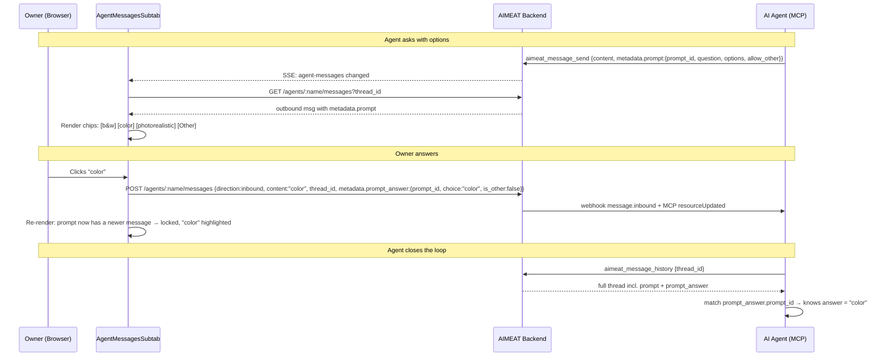

# Message Option-Prompts Implementation Plan

> **For agentic workers:** REQUIRED SUB-SKILL: Use superpowers:subagent-driven-development (recommended) or superpowers:executing-plans to implement this plan task-by-task. Steps use checkbox (`- [ ]`) syntax for tracking.

**Goal:** Let an agent attach a single-select option list to a message ("What kind of image? [black and white, color, photorealistic]"). The owner answers by clicking a chip in the Messages tab — or types a free-text answer via the always-present "Other" option. Because the agent authored the options, it can interpret the answer unambiguously. Add an `aimeat_message_history` MCP tool so the agent can read full thread context (not just the unread inbox) and correlate the answer back to its question.

**Why now:** Today the agent→user channel is one-way prose. The owner's reply is free text the agent has to re-parse, and the agent can only read *pending* inbound messages (no thread history tool exists), so context depends on fragile daemon-session memory. Option-prompts make the round-trip deterministic; `message_history` makes context durable.

**Architecture:** Additive only. Option-prompts ride on the existing `message.metadata` JSON blob (same mechanism `proposedTask` already uses), so **no storage migration**. The answer is a normal inbound message that carries a correlation id in its own metadata. The "answered → locked" rule is derived at render time (is there any newer message in the thread?), not stored as state.

**Tech Stack:** Preact + HTM (no build step), Zod schemas, existing CSS variable system, existing agent message REST + MCP layers.

**Decisions locked (from design review):**
- Scope: option-lists only (not a generic prompt primitive).
- Single-select by default; multi-select is out of scope for v1.
- "Other" is always available — the owner can always type free text.
- An option-prompt becomes **locked (read-only)** once any newer message exists in the thread after it. Chips stay visible; the chosen one is highlighted.
- `aimeat_message_history` is in scope — the feature is half-baked without it.

---

## Data shape

Added to `message.metadata` on an **outbound** (agent→owner) message:

```jsonc
"prompt": {
  "prompt_id": "uuid",          // correlation id, agent-generated
  "question": "What kind of image do you want me to create?",
  "options": ["black and white", "color", "photorealistic"],
  "allow_other": true            // always true in v1; reserved for future
}
```

The owner's reply is a normal **inbound** message whose `content` is the literal choice text (so it reads naturally in the transcript and is human-typable), plus correlation metadata:

```jsonc
"prompt_answer": {
  "prompt_id": "uuid",           // echoes the question's prompt_id
  "choice": "color",             // the chosen option, or the free text for "Other"
  "is_other": false              // true when the owner used "Other"
}
```

The agent reads the thread via `aimeat_message_history`, matches `prompt_answer.prompt_id` to its own `prompt.prompt_id`, and knows exactly which question was answered and with what.

---

## Sequence Diagram



---

## Tasks

### Phase 1 — Schema & storage (backend, no migration)

- [ ] **1.1** In `aimeat/src/models/agent-message-schemas.ts`, extend `metadata` in `AgentMessageCreateSchema`:
  - add `prompt: z.object({ prompt_id: z.string(), question: z.string().min(1).max(2000), options: z.array(z.string().min(1).max(200)).min(2).max(10), allow_other: z.boolean().default(true) }).optional()`
  - add `prompt_answer: z.object({ prompt_id: z.string(), choice: z.string().min(1).max(10000), is_other: z.boolean().default(false) }).optional()`
- [ ] **1.2** In `aimeat/src/storage/interface.ts`, extend `AgentMessageRecord.metadata` with the same two optional fields (camelCase: `prompt`, `promptAnswer`). Keep the existing `tokensUsed`/`processingMs`/`proposedTask`.
- [ ] **1.3** In `aimeat/src/routes/agent-messages.ts` (POST handler, ~line 104), map the new snake_case body fields into the camelCase record metadata. Storage is a JSON blob in both SQLite and Mongo — confirm both round-trip the new keys (they should, since metadata is opaque), no schema/table change.
- [ ] **1.4 (test)** E2E: owner posts an inbound `prompt_answer`; agent (or REST) reads it back via thread history and the metadata survives the round-trip on **both** SQLite and Mongo.

### Phase 2 — `aimeat_message_history` MCP tool (the context fix)

- [ ] **2.1** Add catalog entry in `aimeat/src/mcp/catalog/definitions.ts` for `aimeat_message_history` (description: "Read the full message history for a thread — both your messages and the owner's, oldest-first — so you have complete context, not just unread items. Use this to find the owner's answer to an option-prompt you sent: match prompt_answer.prompt_id to the prompt_id of your question.").
- [ ] **2.2** Add it to the appropriate surface in `aimeat/src/mcp/catalog/surfaces.ts` (next to `aimeat_message_inbox`).
- [ ] **2.3** Register the server-side MCP tool in `aimeat/src/mcp/agent-messages.ts` — params `thread_id?` (optional; omitting returns recent across threads), `page?`, `per_page?`. Wrap `storage.listMessages(agentGaii, {...})`. Return id, thread_id, direction, sender, content, metadata, created_at — **including** `metadata.prompt` / `metadata.promptAnswer`.
- [ ] **2.4** Register the CLI-connect MCP tool in `aimeat/src/cli/connect/mcp/tools/agent-messages.ts` (the `agent_name`-scoped variant) wrapping `GET /v1/agents/:name/messages?thread_id=`.
- [ ] **2.5** No new REST route needed — `GET /v1/agents/:name/messages` already supports `thread_id`, pagination, and returns metadata. Verify metadata is included in that response shape; if the serializer strips unknown metadata keys, fix it.
- [ ] **2.6 (test)** E2E: agent sends two messages + owner sends one in a thread → `aimeat_message_history` returns all three oldest-first with metadata intact.

### Phase 3 — UI: render & answer option-prompts

- [ ] **3.1** In `aimeat/public/views/profile/agents-messages-subtab.js`, add an `OptionPrompt` component (model it on the existing `ProposedTask`). Renders when an **outbound** message has `metadata.prompt`. Shows `question`, one button per option, plus an always-present "Other" button.
- [ ] **3.2** **Locked logic (derived, not stored):** a prompt is answerable only if it is the most recent message in the thread (no message has a later `createdAt`). Compute this in the subtab where the full sorted message list is available, pass `locked` + `answeredChoice` down to `OptionPrompt`. `answeredChoice` = the `choice` from the next inbound message's `prompt_answer` matching this `prompt_id` (for highlighting).
- [ ] **3.3** On option click: `sendMessage(agentName, choice, threadId)` with metadata `prompt_answer:{prompt_id, choice, is_other:false}`. On "Other" click: focus the main chat input and stage the `prompt_id` so the next free-text send attaches `prompt_answer:{prompt_id, choice:text, is_other:true}`.
- [ ] **3.4** Update `sendMessage` in `aimeat/public/js/services/agent-messages.js` to accept and forward an optional `metadata` arg (currently it likely only sends `content`/`thread_id` — confirm and extend).
- [ ] **3.5** When locked: render chips disabled, highlight `answeredChoice` (use existing theme vars — `--accent` for the chosen chip, muted for the rest). No new colors.
- [ ] **3.6** CSS in `aimeat/public/css/views/agents-detail.css` (or wherever `agd-msg-*` lives) using existing variables only — `agd-msg-prompt`, `agd-msg-prompt-option`, `agd-msg-prompt-option--chosen`, `agd-msg-prompt-option:disabled`. No inline styles, no `rgba(255,255,255)`.

### Phase 4 — i18n & instructions

- [ ] **4.1** Add keys to **both** `aimeat/locales/en.json` and `fi.json` under `profile.agents.messages`: `promptOther` ("Other..."), `promptAnswered` (optional caption), `promptLocked` (tooltip/aria). Keep key structure identical in both files.
- [ ] **4.2** Document the option-prompt convention in the agent handbook so agents actually use it: update `aimeat/src/routes/bootstrap.ts` and/or the relevant `aimeat_handbook_get` module (messages section). Include: when to use options, single-select default, that "Other" is implicit (do NOT add it to the options array — the UI adds it), and the prompt_id/prompt_answer correlation contract.
- [ ] **4.3** Update tool descriptions if the message-send catalog text should mention the `prompt` metadata option.

### Phase 5 — Spec sync & verification

- [ ] **5.1** Update `openapi.yaml`: the `/v1/agents/{name}/messages` POST request body `metadata` schema gains `prompt` and `prompt_answer`; add the `aimeat_message_history` behavior if MCP tools are documented there. Run `pnpm generate:types`.
- [ ] **5.2** `pnpm typecheck` + `pnpm lint` clean.
- [ ] **5.3** E2E suite `agent-messages` (and `agent-tasks` if touched) green on SQLite, then full sweep on MongoDB.
- [ ] **5.4** Playwright spec for the Messages tab: agent message with options renders chips; clicking sends the answer; a follow-up message locks the prompt and highlights the choice; "Other" routes to the input.

---

## Risks & mitigations

| Risk | Mitigation |
|------|------------|
| **Agents never use it** — a metadata field is invisible to the model without docs. | Phase 4.2 handbook entry with a concrete example is mandatory, not optional. This is the #1 adoption risk. |
| **Stale prompt** — owner answers a day later, agent's live session is gone. | Answer routes through stored messages + `prompt_id`; `aimeat_message_history` (Phase 2) lets a fresh agent session recover full context. |
| **"Other" ambiguity** — agent treats free text as a new request, not an answer. | `prompt_answer.prompt_id` on the reply binds it to the specific question; handbook tells the agent to check for it. |
| **Double-answer / changed mind.** | "Locked once a newer message exists" rule (Phase 3.2) makes prompts effectively single-use without storing extra state. |
| **XSS via agent-authored option labels.** | Labels render through Preact text interpolation (auto-escaped); options are length-capped (Phase 1.1) and shown only to the owner, never cross-agent. Low risk. |
| **Metadata stripped by serializer.** | Phase 2.5 explicitly verifies the REST/MCP response includes `metadata.prompt`/`promptAnswer`. |

## Out of scope (v1)
- Multi-select prompts.
- Non-option prompt types (sliders, confirmations, file pickers).
- Cross-agent option-prompts (this is owner↔agent only).
- Storing answer state on the original message (derived at render instead).
