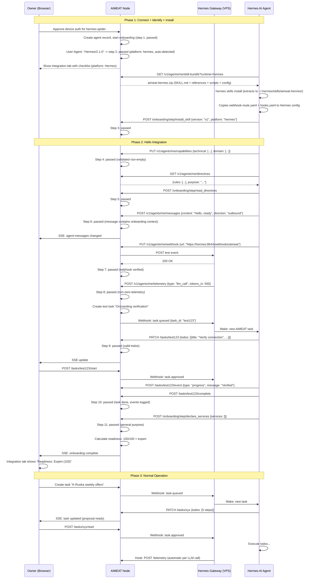
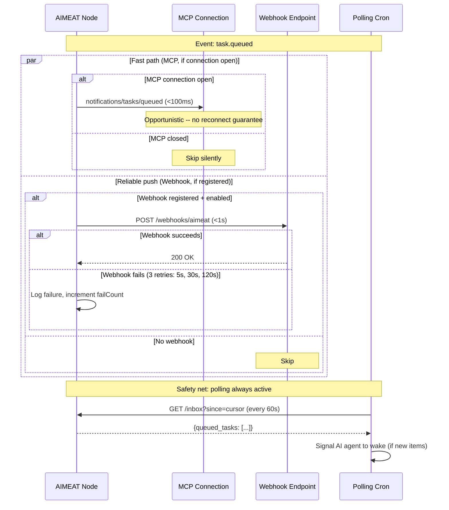

# Agent Integration Architecture -- Design Spec

**Status:** Draft
**Date:** 2026-05-23
**Authors:** Jouni Miikki (concept + architecture), Claude (codebase grounding)

---

## What This Is

A complete redesign of how AI agents connect to, communicate with, and are governed by AIMEAT nodes. Replaces the current daemon-based boot protocol (tier1 prompt that instructs agents to build watchdog processes) with a three-tier push architecture, installable skill bundles, a structured onboarding handshake ("Hello Integration"), and a governance layer for oversight and control.

### Why This Exists

The Hermes-spider production failure (2026-05-22) proved that AIMEAT's boot protocol assumes daemon-like agents (persistent state, spawn workers, active telemetry reporting, poll inbox). Real agent runtimes (Hermes, Claude Code, OpenClaw, TrustClaw) are session-scoped reasoning instances. The agent did exactly what was asked -- built a Python watchdog -- but the result was fragile: env vars leaked between processes, telemetry was zero because the agent can't reliably self-report token usage, and the watchdog didn't survive gateway restart.

The fix is architectural: AIMEAT pushes to agents via native mechanisms, agents install skill bundles once, telemetry flows through runtime hooks automatically, and a structured onboarding process validates each agent's capabilities before it enters production.

### Scope

One spec, three implementation phases:
- **Phase A:** Push layer + Skill bundle (foundation)
- **Phase B:** Hello Integration onboarding
- **Phase C:** Governance (monitoring + control)

Target runtime for reference implementation: **Hermes (OpenClaw)** on a VPS with a public IP.

---

## Part 1: Three-Tier Push Architecture

### Problem

Agents poll `GET /inbox` every 60 seconds. This requires a watchdog daemon that doesn't survive in session-scoped runtimes. Even when it works, it wastes tokens on empty polls and adds 0-60 seconds latency.

### Solution: Graceful Degradation

Three delivery tiers, automatically negotiated. Higher tiers are preferred; lower tiers are always-available fallbacks.

| Tier | Mechanism | Latency | Reliability | When active |
|------|-----------|---------|-------------|-------------|
| **1. MCP notifications** | Server pushes over open MCP connection | <100ms | Opportunistic (session-scoped, no reconnect guarantee) | MCP connection open |
| **2. Webhook** | AIMEAT POSTs to agent's HTTPS endpoint | <1s | High (retries, HMAC-verified, logged) | Runtime up, webhook registered |
| **3. Polling** | Runtime-native cron in `no_agent` mode (zero LLM cost) | 0-60s | Always available | Always (fallback) |

**Tier ordering is by latency, not reliability.** Webhook (Tier 2) is the reliable push backbone. MCP (Tier 1) is a latency optimization that fires when the connection happens to be open. Both fire for the same event -- they are not mutually exclusive fallbacks.

**Critical convention:** Polling does NOT mean "agent builds a watchdog." It means "skill bundle installs the runtime's native cron job." This convention is locked in the reference implementation.

### Webhook Infrastructure

**New fields on AgentRecord:**

```typescript
webhookUrl?: string;          // https://hermes.example.com:8644/webhooks/aimeat
webhookSecret?: string;       // HMAC shared secret for signature verification
webhookEnabled: boolean;      // Owner can disable without deleting URL
webhookLastSuccess?: string;  // ISO timestamp of last successful delivery
webhookLastFailure?: string;  // ISO timestamp of last failed delivery
webhookFailCount: number;     // Consecutive failures (auto-disable at 10)
```

**Events that trigger webhook:**

| Event | Payload | When |
|-------|---------|------|
| `task.queued` | `{task_id, title, has_todos}` | Owner creates a task |
| `task.approved` | `{task_id, title, todo_count}` | Owner clicks Start |
| `task.updated` | `{task_id, changed_fields}` | Owner edits a task |
| `message.inbound` | `{message_id, thread_id, preview}` | Owner sends a message |
| `directive.updated` | `{agent_name}` | Directives change |
| `onboarding.step` | `{step_id, action}` | Hello Integration step triggered |

**Webhook delivery:**
- HMAC-SHA256 signature in `X-AIMEAT-Signature` header
- Retry 3x: 5s, 30s, 120s (reuses existing `fireWebhook` pattern from `work.ts`)
- SSRF validation on webhook URL (reuses existing `isAllowedWebhookUrl`)
- Auto-disable after 10 consecutive failures, visible in UI as red status
- Delivery log: last 50 deliveries stored per agent, visible in Integration tab

**REST endpoints:**

```
PUT    /v1/agents/:name/webhook       -- Register/update webhook
GET    /v1/agents/:name/webhook       -- Get webhook config + status
DELETE /v1/agents/:name/webhook       -- Remove webhook
POST   /v1/agents/:name/webhook/test  -- Send test event, return delivery result
```

### MCP Notifications

**Scope clarification:** MCP notifications are opportunistic -- they work when an MCP connection happens to be open in the current session. The MCP spec does not guarantee notification subscriptions survive reconnects, and whether a given runtime (Hermes, Claude Code) re-subscribes after a connection drop is runtime-specific behavior outside AIMEAT's control. This means MCP is not a reliable persistent delivery channel. It is "Tier 1" in terms of *latency* (fastest when available), not in terms of *reliability* (webhook is more reliable for guaranteed delivery).

**Implementation consequence:** AIMEAT MUST always check webhook/polling fallback after sending an MCP notification. The delivery logic is: try MCP if connection open -> regardless of MCP result, the event is also queued for webhook/polling if those are configured. MCP is a fast-path optimization, not a replacement for webhook delivery.

When an MCP connection is open, AIMEAT's MCP server pushes notifications directly:

```typescript
// In task creation handler, after storage write:
mcpServer.notify('notifications/tasks/queued', {
  task_id: task.id,
  title: task.title,
  has_todos: task.todos.length > 0,
});
// Webhook fires independently (not "else" -- both channels active)
```

No registration needed. Works automatically when MCP connection exists. But webhook is the reliable push path -- MCP is a latency bonus, not a delivery guarantee.

### Inbox Delta Endpoint

Polling fallback uses a cursor-based delta endpoint instead of returning the full inbox every time:

```
GET /v1/agents/me/inbox?since=2026-05-23T14:28:03.123Z@evt_550e8400
```

#### Cursor Format

The cursor is a composite string: **ISO 8601 timestamp + `@` + event ID tie-breaker**.

```
{ISO timestamp}@{event_id_prefix}
2026-05-23T14:28:03.123Z@evt_550e8400
```

- **Timestamp** -- when the event occurred (millisecond precision, UTC)
- **Tie-breaker** -- first 12 chars of the event UUID, disambiguates events with identical timestamps
- **Client treats it as opaque** -- clients store and replay the cursor as-is, never parse it
- **Server uses both parts** -- `WHERE timestamp > :ts OR (timestamp = :ts AND id > :tiebreaker)` for stable pagination even at high event rates

The cursor is returned in every delta response as `next_cursor`. Clients store it and send it back on the next poll.

#### Edge Cases

| Scenario | Server behavior | Response |
|----------|----------------|----------|
| **No cursor** (`?since` omitted) | Return all pending items (initial sync) | `200` with items + `next_cursor` |
| **Valid cursor, new events exist** | Return events after cursor | `200` with items + `next_cursor` |
| **Valid cursor, no new events** | Empty result | `200` with `{"items": [], "next_cursor": "{same_cursor}"}` |
| **Cursor event pruned but timestamp < 90 days** | Treat timestamp as best-effort anchor, return everything remaining since that timestamp | `200` with items + `next_cursor` + `"cursor_status": "approximate"` |
| **Cursor older than 90 days** | Reject -- client must reset | `400` with error code `PRUNED_CURSOR`, message: "Cursor expired. Omit ?since to perform full sync." |
| **Malformed cursor** (not `{ISO}@{id}` format) | Reject | `400` with error code `INVALID_CURSOR` |

#### Retention Policy

- Inbox events are retained for **90 days** (configurable via `AIMEAT_INBOX_RETENTION_DAYS`)
- Pruning runs on server startup and daily via internal cron
- When a cursor points to a pruned event but the timestamp is still within the 90-day window, the server uses the timestamp component alone and returns whatever remains -- this means the client may see some items it already processed (idempotency is the client's responsibility)
- The `cursor_status` field signals this: `"exact"` (normal) or `"approximate"` (tie-breaker event was pruned, timestamp-only match used)

#### Response Format

```jsonc
{
  "node": "aimeat-fi-001-genesis",
  "ok": true,
  "data": {
    "items": [
      {
        "type": "task.queued",
        "task_id": "550e8400-e29b-41d4-a716-446655440000",
        "title": "K-Ruoka weekly offers",
        "timestamp": "2026-05-23T14:28:03.123Z"
      },
      {
        "type": "message.inbound",
        "message_id": "660e8400-e29b-41d4-a716-446655440001",
        "thread_id": "770e8400-e29b-41d4-a716-446655440002",
        "preview": "Can you also check S-Market?",
        "timestamp": "2026-05-23T14:32:00.000Z"
      }
    ],
    "next_cursor": "2026-05-23T14:32:00.000Z@660e8400",
    "cursor_status": "exact",
    "has_more": false
  }
}
```

`has_more: true` means there are more items beyond the page limit (default 50, max 200 via `?limit=`). Client should immediately re-poll with `next_cursor` without waiting for cron interval.

### Delivery Status in UI

Per-agent delivery status shown in the Integration tab and agent card:

```
Delivery: MCP notifications (instant)
Delivery: Webhook (push, <1s)
Delivery: Polling (60s) -- webhook not registered [Enable webhook ->]
```

### Documentation Framing

In `/llms.txt` and agent-facing documentation:

> AIMEAT delivers events through three channels: webhooks (reliable push to your HTTPS endpoint, retries + HMAC signature), MCP notifications (instant when MCP connection is open), and polling (always-available fallback via cron). Webhook and MCP fire in parallel for the same event -- MCP is a latency bonus, webhook is the reliable backbone, polling is the safety net.

This framing communicates webhook as the workhorse and MCP as a fast-path bonus, avoiding the misconception that MCP is a guaranteed delivery tier.

---

## Part 2: Skill Bundle

### Problem

Agents receive a 60+ line boot prompt every session. They must read, understand, and implement everything from scratch each time. Context explosion, error-prone, not versioned.

### Solution

Agents install a skill bundle once. The bundle contains reference docs, helper scripts, and onboarding instructions. Updates via a separate command.

**The skill bundle is node-generated, not static.** Each node generates its own bundle with variables (node URL, agent GAII, directives) pre-filled. This eliminates the "read tier1 and fill in variables" step.

**The skill bundle is runtime-specific.** Each runtime (Hermes, Claude Code, OpenClaw) has different config formats, hook mechanisms, and install paths. The bundle is named explicitly per runtime: `aimeat-hermes`, `aimeat-claude-code`, `aimeat-openclaw`. The generator produces different ZIPs from the same core data.

### Generator Architecture

```
                          +-- references/  (shared, all runtimes)
                          |     api-overview.md
                          |     task-lifecycle.md
                          |     message-protocol.md
                          |     telemetry-protocol.md
skill-bundle-generator ---+     capability-report.md
  (src/services/)         |     error-protocol.md
                          |
                          +-- runtime adapters:
                                hermes-adapter.ts   -> aimeat-hermes.zip
                                claude-code-adapter.ts -> aimeat-claude-code.zip
                                generic-adapter.ts  -> aimeat-agent.zip (fallback)
```

The generator has two layers:

1. **Core content** -- `references/` directory, shared across all runtimes. API docs, lifecycle docs, protocol docs. Generated once from node config + agent record.
2. **Runtime adapter** -- produces the runtime-specific SKILL.md, scripts, and config files. Each adapter knows the target runtime's conventions (skill manifest format, hook registration, config file syntax).

Phase A ships with the **Hermes adapter** only. Other adapters are added as those runtimes are validated.

### Bundle Structure: `aimeat-hermes`

```
aimeat-hermes/
+-- SKILL.md                     # Hermes skill manifest + on-wake protocol
+-- references/                  # Shared (identical across runtimes)
|   +-- api-overview.md          # Pre-filled: node URL, GAII, endpoints
|   +-- task-lifecycle.md        # Propose -> approve -> execute -> complete
|   +-- message-protocol.md     # Inbox, send, threads, linked tasks
|   +-- telemetry-protocol.md   # What to report, how, when
|   +-- capability-report.md    # PUT /capabilities format
|   +-- error-protocol.md       # Retry, backoff, fail reporting
+-- scripts/                     # Hermes-specific
|   +-- poll-inbox.sh            # Cron script: no_agent mode, zero LLM cost
|   +-- post-telemetry.sh       # Hook: post_llm_call -> POST /telemetry
|   +-- test-connection.sh       # Healthcheck: GET /inbox, verify auth
+-- config/                      # Hermes-specific
    +-- webhook-route.yaml       # Hermes webhook route config (copy-paste ready)
    +-- hooks.yaml               # Hermes hook registration (post_llm_call, etc.)
```

### Bundle Structure: `aimeat-claude-code` (Phase A+1)

```
aimeat-claude-code/
+-- CLAUDE.md                    # Claude Code project instructions format
+-- references/                  # Shared (identical)
|   +-- api-overview.md
|   +-- task-lifecycle.md
|   +-- ...
+-- .claude/
    +-- settings.json            # MCP server config pointing to AIMEAT node
    +-- hooks/
        +-- post-tool-call.sh    # Hook: post_tool_call -> POST /telemetry
```

### Bundle Structure: `aimeat-openclaw` (Phase A+1)

```
aimeat-openclaw/
+-- skill.yaml                   # OpenClaw skill manifest
+-- references/                  # Shared (identical)
|   +-- api-overview.md
|   +-- ...
+-- hooks/
|   +-- post-llm-call.py        # OpenClaw hook format
+-- config/
    +-- webhook.yaml             # OpenClaw webhook config
```

### SKILL.md (Hermes Format)

```markdown
---
name: aimeat-hermes
description: AIMEAT node integration for {node_id}
trigger: when user mentions AIMEAT, tasks, inbox, or this skill is invoked
---

## Identity
You are {agent_name} on AIMEAT node {node_url}
Your GAII: {agent_gaii}

## On First Run
Complete the Hello Integration checklist (see below).

## On Every Wake
1. Check inbox: GET {node_url}/v1/agents/me/inbox?since={cursor}
2. Queued tasks without todos -> propose plan (PATCH with todos)
3. Active tasks -> execute next pending todo
4. Pending messages -> read and respond
5. Report capabilities if changed

## References
See references/ directory for detailed API documentation.
```

### REST Endpoint

```
GET /v1/agents/:name/skill-bundle?runtime=hermes
Authorization: Bearer {token}
Accept: application/zip

Response: aimeat-hermes.zip
```

The `runtime` query parameter selects which adapter generates the bundle:

| `?runtime=` | Bundle name | Adapter |
|-------------|-------------|---------|
| `hermes` (default) | `aimeat-hermes` | `hermes-adapter.ts` |
| `claude-code` | `aimeat-claude-code` | `claude-code-adapter.ts` |
| `openclaw` | `aimeat-openclaw` | `openclaw-adapter.ts` |
| omitted or unknown | `aimeat-agent` | `generic-adapter.ts` (references only, no runtime config) |

The generic fallback includes only `references/` and a minimal `SKILL.md` with no runtime-specific config. Useful for unsupported runtimes where the developer manually sets up hooks and config.

### Installation Per Runtime

| Runtime | Install command | What happens |
|---------|----------------|--------------|
| **Hermes** | `hermes skills install {node_url}/v1/agents/me/skill-bundle?runtime=hermes` | ZIP extracted to `~/.hermes/skills/aimeat-hermes/`, webhook route + hooks auto-registered |
| **Claude Code** | Download ZIP, extract to project root | `CLAUDE.md` instructions + `.claude/` config in place |
| **OpenClaw** | `openclaw skill install {url}/v1/agents/me/skill-bundle?runtime=openclaw` | Skill manifest + hooks registered |
| **Generic** | `curl -H "Auth: Bearer {token}" {url}/v1/agents/me/skill-bundle -o aimeat-agent.zip && unzip` | Reference docs only, manual setup |

### Versioning

- Bundle contains a `version` field (content hash of core + runtime-specific content)
- `GET /v1/agents/:name/skill-bundle/version?runtime=hermes` returns just the version string (lightweight check)
- Hermes: `hermes skills update aimeat-hermes` fetches new version if changed
- UI shows: "Skill v3 (hermes) installed, latest is v5 -- [Update available]"
- Runtime is stored on `AgentOnboardingRecord.installedRuntime` so the node knows which adapter to use for updates and UI display

### What This Replaces

- Tier1 boot prompt no longer needed every session (skill is persistent)
- `GET /v1/prompts/tier1` remains for backward compatibility + MCP agents, but is not the primary path
- Integration kit endpoint (`GET /v1/agents/:name/integration-kit`) superseded by skill bundle

---

## Part 3: Hello Integration -- Onboarding Handshake

### Concept

When an agent connects for the first time (or when the owner wants to re-validate), AIMEAT runs a structured onboarding process. Each step is a concrete API call that the agent makes and AIMEAT validates. The result is a readiness score and timestamps for every step.

This is not a freeform "do these things" instruction. AIMEAT knows exactly what the steps are, tracks each one, and shows progress in the UI in real time.

### Onboarding Steps

```
HELLO INTEGRATION CHECKLIST
============================

Step 1:  AUTHENTICATE          Agent is authenticated (happens during connect)
Step 2:  IDENTIFY PLATFORM     Which AI platform is this agent running on?
Step 3:  INSTALL SKILL         Skill bundle installed, version reported
Step 4:  REPORT CAPABILITIES   PUT /capabilities called, AIMEAT validates
Step 5:  READ DIRECTIVES       GET /directives called, agent confirms reading
Step 6:  SEND TEST MESSAGE     POST /messages with onboarding token (proves channel)
Step 7:  CONFIGURE DELIVERY    Webhook registered OR MCP detected OR polling confirmed
Step 8:  REPORT TELEMETRY      At least one telemetry event with non-zero data
Step 9:  ACCEPT TEST TASK      AIMEAT creates mini-task, agent proposes todos, AIMEAT validates
Step 10: COMPLETE TEST TASK    Agent executes test task todos, completes, AIMEAT checks
Step 11: DECLARE SERVICES      Agent declares offered services (can be empty = general purpose)
```

### Step 2: Identify Platform -- Detail

Before AIMEAT can generate the correct skill bundle, it needs to know which AI platform the agent runs on. "Platform" is the term used in agent-facing communication (not "runtime" which is an internal/developer term).

**Why this is Step 2 (before Install Skill):** The skill bundle is platform-specific (`aimeat-hermes`, `aimeat-claude-code`, etc.). Without knowing the platform, AIMEAT cannot generate the correct bundle. Step 3 (Install Skill) depends on this.

**Three detection paths (in priority order):**

**Path A: Auto-detect from connection metadata.** When the agent authenticates, AIMEAT checks:
- `User-Agent` header (e.g., `Hermes/2.1.0`, `claude-code/1.0`, `OpenClaw/0.9`)
- MCP client metadata (MCP connection carries client info)
- Known patterns in the JWT or device auth flow

If AIMEAT can confidently identify the platform, Step 2 is marked `passed` automatically with `validationMethod: 'automatic'`.

**Path B: Agent self-reports.** The agent calls:

```
POST /v1/agents/me/onboarding/step/identify_platform
{
  "platform": "hermes",
  "platform_version": "2.1.0"
}
```

**Path C: AIMEAT asks.** If neither auto-detect nor self-report happens within 60 seconds of Step 1 completing, AIMEAT sends a message to the agent:

```
"Welcome to AIMEAT! To set up your integration, I need to know which AI platform
you are running on. Please reply with one of:

  hermes       -- Hermes AI Gateway (OpenClaw)
  claude-code  -- Claude Code (Anthropic CLI / IDE extension)
  copilot      -- GitHub Copilot CLI
  codex        -- OpenAI Codex CLI
  gemini       -- Google Gemini CLI
  other        -- Other platform (describe in your reply)

This determines which skill bundle and configuration format I generate for you.
If you're not sure, reply with 'other' and describe your environment."
```

The agent's reply is parsed (fuzzy match against known platforms). If matched, Step 2 passes. If "other" or unrecognized, AIMEAT stores the raw response and falls back to the generic bundle.

**Known platforms registry:**

| Platform ID | Display name | Skill bundle | Auto-detect signal |
|-------------|-------------|--------------|-------------------|
| `hermes` | Hermes (OpenClaw) | `aimeat-hermes` | User-Agent: `Hermes/*` |
| `claude-code` | Claude Code | `aimeat-claude-code` | MCP client metadata, User-Agent: `claude-code/*` |
| `copilot` | GitHub Copilot CLI | `aimeat-copilot` | User-Agent: `copilot-cli/*` |
| `codex` | OpenAI Codex CLI | `aimeat-codex` | User-Agent: `codex/*` |
| `gemini` | Google Gemini CLI | `aimeat-gemini` | User-Agent: `gemini-cli/*` |
| `other` | Other / Unknown | `aimeat-agent` (generic) | Fallback |

New platform IDs can be added to the registry without code changes (stored in config/DB). The admin dashboard manages the registry (see Part 6).

**Data stored on AgentRecord:**

```typescript
platform?: string;            // "hermes", "claude-code", "copilot", etc.
platformVersion?: string;     // "2.1.0" -- reported by agent or auto-detected
platformDetectedBy?: 'auto' | 'self_report' | 'message_reply';
```

### Data Model

```typescript
interface AgentOnboardingRecord {
  agentGaii: string;
  status: 'pending' | 'in_progress' | 'completed' | 'failed';
  startedAt: string;
  completedAt?: string;
  steps: AgentOnboardingStep[];   // 11 steps (authenticate through declare_services)
  readinessScore?: number;        // 0-100, calculated automatically
  readinessLevel?: 'basic' | 'standard' | 'full' | 'expert';
  detectedPlatform?: string;      // From Step 2: "hermes", "claude-code", "copilot", etc.
  installedRuntime?: string;      // Confirmed after Step 3: which bundle was actually installed
}

interface AgentOnboardingStep {
  id: string;                     // "authenticate", "install_skill", etc.
  order: number;
  title: string;
  description: string;
  status: 'pending' | 'passed' | 'failed' | 'skipped';
  required: boolean;              // false = can skip, readiness score lower
  validatedAt?: string;           // ISO timestamp when AIMEAT validated
  validationMethod: 'automatic' | 'api_call' | 'owner_confirm';
  details?: Record<string, unknown>;
  failureReason?: string;
}
```

### Step Validation

AIMEAT does not trust the agent's word. Every step is validated:

| Step | Validation | How AIMEAT knows |
|------|-----------|------------------|
| 1. Authenticate | Automatic | JWT exists, agent record created |
| 2. Identify Platform | Auto / API call / message | User-Agent match, OR `POST /onboarding/step/identify_platform`, OR parsed message reply |
| 3. Install Skill | API call | Agent calls `POST /onboarding/step/install_skill` reporting version + platform |
| 4. Capabilities | Automatic | `PUT /capabilities` called, `AgentRecord.technicalCapabilities` not empty |
| 5. Read Directives | API call | `GET /directives` access log + agent confirms via `POST /onboarding/step/read_directives` |
| 6. Test Message | Automatic | `POST /messages` with content containing onboarding token |
| 7. Configure Delivery | Automatic | `webhookUrl` set OR MCP connection detected OR polling event seen |
| 8. Telemetry | Automatic | At least 1 event where `details.telemetry` is non-zero |
| 9. Accept Test Task | Automatic | AIMEAT creates task, agent PATCHes with valid todos |
| 10. Complete Test Task | Automatic | Test task status = done, todos done, event log not empty |
| 11. Declare Services | API call | `POST /onboarding/step/declare_services` (empty list = general purpose) |

### REST Endpoints

```
GET    /v1/agents/:name/onboarding           -- Get onboarding status + all steps
POST   /v1/agents/:name/onboarding/start     -- Start/reset onboarding (creates test task)
POST   /v1/agents/:name/onboarding/step/:id  -- Agent confirms a step
DELETE /v1/agents/:name/onboarding           -- Cancel in-progress onboarding
```

### Readiness Scoring

Readiness is a **composite score** built from two components: a stable onboarding baseline and a slow-moving operational health signal.

#### Component 1: Onboarding Baseline (0-100, set once)

Calculated when onboarding completes. Does not degrade over time -- this is a capability assessment, not a health check.

```
Required steps (1-10): 9 points per passed step = max 90
  Step 1:  Authenticate        (9 pts, required)
  Step 2:  Identify Platform   (9 pts, required)
  Step 3:  Install Skill       (9 pts, required)
  Step 4:  Capabilities        (9 pts, required)
  Step 5:  Read Directives     (9 pts, required)
  Step 6:  Test Message        (9 pts, required)
  Step 7:  Configure Delivery  (9 pts, required)
  Step 8:  Telemetry           (9 pts, required)
  Step 9:  Accept Test Task    (9 pts, required)
  Step 10: Complete Test Task  (9 pts, required)

Optional (step 11 services): 10 points if declared = max 100
```

The baseline only changes when the owner runs "Re-run Hello Integration."

#### Component 2: Operational Health (multiplier, 0.0-1.0)

A 7-day rolling average of three operational signals. Recalculated daily (not on every event -- prevents flash degradation).

| Signal | Weight | What it measures | 1.0 = healthy | 0.0 = failed |
|--------|--------|-----------------|---------------|---------------|
| Delivery health | 40% | Webhook success rate over 7 days | >95% success | <50% or auto-disabled |
| Telemetry continuity | 30% | Days with at least one telemetry event in the last 7 | 7/7 days | 0/7 days |
| Task completion | 30% | Tasks completed vs failed/stalled in the last 7 days | >80% completed | <30% or no tasks |

If a signal has no data (e.g., no tasks assigned in 7 days), it scores 1.0 (benefit of the doubt -- absence of failure is not failure).

#### Effective Score

```
effective_readiness = floor(onboarding_baseline * operational_health)
```

Example: baseline 90 (full onboarding), health multiplier 0.95 (one webhook hiccup) = effective readiness 85 = still "full."

Example: baseline 90, webhook down for 3 days (delivery health drops to 0.4), telemetry gap 2 days (continuity 0.71), no tasks affected (1.0) = health multiplier: 0.4*0.4 + 0.71*0.3 + 1.0*0.3 = 0.16 + 0.213 + 0.3 = 0.673 = effective readiness 60 = drops to "standard" border. Not flash -- took 3 days of sustained failure.

#### Readiness Levels

| Level | Effective score | Rights |
|-------|----------------|--------|
| basic | 0-30 | Can receive messages. No tasks. |
| standard | 31-60 | Can receive tasks, propose-only (no self-start). Max 3 tasks/day. |
| full | 61-90 | All rights. Propose-before-start still mandatory. |
| expert | 91-100 | All + can self-start tasks tagged "urgent." |

#### Degradation and Recovery

**Degradation is slow.** The 7-day rolling window means a 2-hour outage barely dents the score. A single bad day reduces health by at most ~14% (1/7). The agent stays at its current level unless the problem persists for multiple days.

**Recovery is automatic.** When infrastructure recovers (webhook starts succeeding, telemetry resumes), the health multiplier climbs back over the following days as the bad data points roll out of the 7-day window. No manual intervention needed.

**Timeline for a full-outage scenario:**

| Day | What happens | Delivery (40%) | Telemetry (30%) | Health | Effective (base 90) | Level |
|-----|-------------|----------------|-----------------|--------|--------------------:|-------|
| 0 | Webhook breaks | 0.86 (6/7 good) | 0.86 | 0.91 | 81 | full |
| 1 | Still down | 0.71 | 0.71 | 0.81 | 72 | full |
| 2 | Still down | 0.57 | 0.57 | 0.73 | 65 | full |
| 3 | Still down | 0.43 | 0.43 | 0.64 | 57 | standard |
| 4 | **Fixed**, starts recovering | 0.43 | 0.43 | 0.64 | 57 | standard |
| 5 | 2 good days in window | 0.57 | 0.57 | 0.73 | 65 | full |
| 7 | 4 good days in window | 0.86 | 0.86 | 0.91 | 81 | full |
| 10 | Fully recovered | 1.0 | 1.0 | 1.0 | 90 | full |

**Key property:** the agent loses "full" status after 3 days of sustained failure, not after a 2-hour blip. And it recovers to "full" within ~3 days of the fix.

#### Owner Override

The owner can always manually set `readinessLevel` via the Integration tab. This overrides the calculated level until the next recalculation cycle. Use case: "I know the webhook is down because I'm migrating servers, keep the agent at full."

Override is shown in UI: `Readiness: Full (87) [manual override, expires in 23h]`

Override expires after 24h (re-evaluated on next daily recalculation). Owner can re-apply.

#### Data Model Extension

```typescript
interface AgentOnboardingRecord {
  // ... existing fields ...
  onboardingBaseline?: number;          // 0-100, set when onboarding completes
  operationalHealth?: number;           // 0.0-1.0, recalculated daily
  healthComponents?: {
    deliveryHealth: number;             // 0.0-1.0
    telemetryContinuity: number;        // 0.0-1.0
    taskCompletion: number;             // 0.0-1.0
  };
  healthRecalculatedAt?: string;        // ISO timestamp of last recalculation
  readinessOverride?: {
    level: 'basic' | 'standard' | 'full' | 'expert';
    setBy: string;                      // Owner GHII who set it
    setAt: string;                      // ISO timestamp
    expiresAt: string;                  // ISO timestamp (setAt + 24h)
    reason?: string;                    // Optional note ("migrating servers")
  };
}
```

### Re-validation

Owner can press "Re-run Hello Integration" at any time:
1. Resets all steps except Authenticate
2. Creates a new test task
3. Agent runs steps again
4. Onboarding baseline recalculates (operational health multiplier is not reset -- it reflects actual recent performance)

Important because agent capabilities change (new skills, new MCP tools, webhook broke). Re-validation only resets the baseline; it does not erase operational history.

---

## Part 4: UI -- Integration Sub-tab

### Placement

New sub-tab in agent detail view. Positioned **first** because it is the starting point for everything else:

```
[ Integration | Tasks | Directives | Capabilities | Activity | Services | Messages ]
```

When a newly created agent is expanded, the Integration tab opens automatically (not Tasks as currently).

### Three UI States

**State 1: Onboarding in progress (or not started)**

Shows the checklist with per-step status, timestamps, and details. Below the checklist: skill bundle install command with copy button, download ZIP button, and curl command.

Progress bar at bottom: `Progress: 5/11`

```
HELLO INTEGRATION                          Readiness: -- / 100

ONBOARDING CHECKLIST

  [check] 1. Authenticate          23 May 14:23  (auto)
  [check] 2. Identify Platform     23 May 14:23  Hermes (auto-detected)
  [check] 3. Install Skill v3      23 May 14:24  aimeat-hermes
  [check] 4. Capabilities          23 May 14:24  (MCP: 3 tools, Domain: 2)
  [check] 5. Read Directives       23 May 14:25
  [check] 6. Test Message          23 May 14:25  (response: 1.2s)
  [empty] 7. Configure Delivery    waiting...
  [empty] 8. Report Telemetry      waiting...
  [empty] 9. Accept Test Task      waiting...
  [empty] 10. Complete Test Task   waiting...
  [empty] 11. Declare Services     optional

  Progress: 6/11

SKILL BUNDLE

  Install command:
  hermes skills install https://aimeat.io/v1/agents/hermes-spider/skill-bundle
  [Copy]  [Download ZIP]  [Copy curl command]

[Re-run Hello Integration]
```

**State 2: Onboarding complete -- governance view**

Connection status (3-tier delivery with current state), skill version, readiness summary with strengths/gaps, and delivery log.

```
INTEGRATION STATUS                    Readiness: Full (87)

CONNECTION
  Delivery:  MCP notifications (instant)
  Webhook:   [check] https://hermes.example.com:8644/...
             Last success: 2 min ago | Failures: 0
  Polling:   Fallback active (5 min interval)
  Last seen: 16s ago (23 May 2026)
                                                    [Edit]

SKILL
  Version: v3 (installed 16 May) | Latest: v3 (up to date)
                                        [Re-install] [Update]

PLATFORM
  Hermes (OpenClaw) v2.1.0 | Detected: auto (User-Agent)

READINESS
  [check] Auth  [check] Platform  [check] Skill  [check] Caps  [check] Dir
  [check] Msg  [check] Delivery  [warn] Telemetry  [check] Tasks  [empty] Services

  Strengths: MCP tools (3), Finnish grocery domain
  Gaps: Telemetry intermittent, no services declared

  Last validated: 23 May 14:30
                                        [Re-run Hello Integration]

DELIVERY LOG
  14:28  task.queued     -> webhook  [check]  (0.3s)
  14:26  message.inbound -> MCP      [check]  (<0.1s)
  14:25  onboarding.step -> webhook  [check]  (0.2s)
  14:23  task.approved   -> webhook  [check]  (0.4s)
                                              [Show all (47)]
```

**State 3: Connection problem**

Warning banner with the specific issue, fallback status, and action buttons.

```
[warn] DELIVERY ISSUE
Webhook failed 3 consecutive times (last: 5 min ago)
Error: Connection refused (https://hermes:8644/...)
Fallback: Polling active (60s interval)

[Test webhook now]  [Update webhook URL]  [Disable]
```

### Agent Card Header

Readiness and platform visible in collapsed agent card:

```
> hermes-spider    HERMES-SPIDER    Hermes    Readiness: Full (87)    FEDERATED
  Trust: 50 | Balance: Uses owner's wallet | Last seen: 16s ago
```

### New Agent Entrypoint

When an agent is approved (device auth), AIMEAT:
1. Creates onboarding record automatically (step 1 = passed)
2. Opens agent detail view on Integration tab
3. Shows skill bundle install instructions
4. Waits for agent to complete subsequent steps

This replaces the current "agent appeared in the list, now what?" experience.

---

## Part 5: Governance -- Telemetry, Monitoring, Control

### Principle

Governance is pervasive, not a separate feature. Every agent action produces data visible to the owner. The owner steers the agent through directives and limits. AIMEAT monitors automatically.

### Telemetry Architecture

**Current state (broken):** Agent tries to self-report tokens from memory. Always fails.

**New model:** Three channels in order of reliability:

| Channel | How | Reliability | What it reports |
|---------|-----|-------------|-----------------|
| **Runtime hook** | `post_llm_call` hook fires automatically | Highest | tokens_in, tokens_out, model, duration |
| **MCP tool wrapper** | AIMEAT MCP server logs each tool call | High | tool_name, duration, success/fail |
| **Agent self-report** | `POST /event` in task events | Low (fallback) | Freeform, agent-estimated numbers |

**Hook-based telemetry (Hermes):**

The skill bundle includes a ready-made hook script `scripts/post-telemetry.sh`. It is registered as Hermes's `post_llm_call` hook during installation. Every LLM call automatically sends:

```json
{
  "type": "llm_call",
  "tokens_in": 1523,
  "tokens_out": 847,
  "model": "anthropic/claude-sonnet-4-20250514",
  "duration_ms": 3200,
  "session_id": "hermes-session-abc",
  "timestamp": "2026-05-23T14:28:03Z"
}
```

**New endpoints:**

```
POST /v1/agents/:name/telemetry    -- Append telemetry event (agent scope)
GET  /v1/agents/:name/telemetry    -- List telemetry (?since=, ?type=, ?per_page=)
```

This is a separate endpoint from task events because telemetry is continuous (also outside task context -- e.g., agent session where it reads messages without an active task).

### Automatic Monitoring

AIMEAT watches agents passively and reacts to anomalies:

**1. Stall detection (existing, extended)**

Current: task stalled if no events for 30 min. Stays.

New extensions:
- Agent hasn't polled inbox for 2h -> status: `unreachable`
- Webhook 10 consecutive failures -> status: `webhook_down`, fallback to polling
- No telemetry for 24h despite agent being "online" -> warning in UI

**2. Budget controls**

Extension to `AgentDirectivesRecord`:

```typescript
budgetLimits?: {
  maxTokensPerTask?: number;      // Per-task cap
  maxTokensPerDay?: number;       // Daily cap
  maxTasksPerDay?: number;        // How many tasks per day
  alertThreshold?: number;        // Percentage at which to warn (e.g. 80)
};
```

Approaching limit: push notification to owner. Exceeding limit: agent gets 429 from telemetry endpoint with an error message explaining why.

**3. Action audit trail**

Every agent API call that mutates data is logged:

```
14:28:03  PUT /capabilities          -- 3 technical, 2 domain
14:28:15  PATCH /tasks/abc/          -- added 5 todos
14:28:20  POST /messages             -- outbound, thread xyz
14:29:01  POST /tasks/abc/start      -- !! AGENT SELF-STARTED (policy violation)
14:30:45  POST /memory               -- key: products.kruoka.offers
```

Policy violation rows appear red. This integrates with the existing Activity sub-tab but adds a governance layer on top.

### Control Mechanisms

Owners steer agents through three mechanisms:

**1. Directives (existing)**
- Rules, memory areas, resources
- Three-layer inheritance (system -> owner -> agent)
- Updates in real time: when owner changes directives, webhook `directive.updated` fires -> agent reads new ones

**2. Task-level control (existing, strengthened)**
- Propose-before-start rule: agent MUST NOT self-start
- Enforced in backend: `POST /start` requires `requireRole('owner')` (gap audit item #4)
- Owner can edit todo list before starting
- Owner can pause active tasks (new: `POST /tasks/:id/pause`)

**3. Readiness-based access control (new)**

Effective readiness score (onboarding baseline * operational health, see Part 3 "Readiness Scoring") determines what the agent can do. The score degrades slowly over a 7-day rolling window and recovers automatically when metrics improve. See Part 3 for the full degradation/recovery model, timeline, and owner override mechanism.

| Level | Effective score | Rights |
|-------|----------------|--------|
| basic | 0-30 | Can receive messages. No tasks. |
| standard | 31-60 | Can receive tasks, propose-only (no self-start). Max 3 tasks/day. |
| full | 61-90 | All rights. Propose-before-start still mandatory. |
| expert | 91-100 | All + can self-start tasks tagged "urgent." |

Configurable through directives (owner can tighten or loosen). Owner can also manually override the level for 24h via the Integration tab (e.g., during planned infra maintenance).

### Activity Tab Governance View

Activity sub-tab extended with governance section:

```
TODAY'S GOVERNANCE

  Token budget:  12,450 / 50,000 (24.9%)
  Tasks today:   2 completed, 1 active, 0 failed
  Policy issues: 1 (self-start attempt at 14:29)
  Telemetry:     47 events received today

  Delivery health:
    MCP: active    Webhook: 23/23 delivered
```

---

## Part 6: Admin Dashboard -- Agent Integration Overview

### Purpose

The admin dashboard (operator view) provides aggregate oversight across all agents on the node. While Part 4's Integration sub-tab shows per-agent detail for owners, the admin dashboard gives the operator a fleet-wide picture: which platforms are in use, which agents are healthy, which are stuck in onboarding, and what the overall readiness distribution looks like.

### Placement

New tab in the admin dashboard:

```
[ Overview | Users | Agents | Federation | ... | Agent Integration ]
```

### Three Sections

**Section 1: Platform Registry**

Operators manage the known platforms list. This is the source of truth for platform IDs, display names, auto-detect patterns, and which skill bundle adapter is available.

```
KNOWN PLATFORMS

  Platform           Agents    Adapter     Auto-detect pattern
  ---------------------------------------------------------------
  Hermes (OpenClaw)  3         aimeat-hermes    User-Agent: Hermes/*
  Claude Code        1         aimeat-claude-code  User-Agent: claude-code/*
  GitHub Copilot     0         (generic)        User-Agent: copilot-cli/*
  OpenAI Codex       0         (generic)        User-Agent: codex/*
  Google Gemini      0         (generic)        User-Agent: gemini-cli/*
  Other              1         aimeat-agent     --

  [Add platform]
```

Adding a new platform:
- Platform ID (kebab-case, unique)
- Display name
- User-Agent pattern (regex for auto-detect, optional)
- Adapter: select from available adapters or "generic"

When a new adapter is implemented (e.g., `aimeat-copilot`), the operator updates the platform registry entry to link it. No code deploy needed for the registry itself.

**Section 2: Onboarding Overview**

Aggregate view of all agents' Hello Integration status.

```
ONBOARDING STATUS                         Total agents: 5

  Completed:    3  (hermes-spider, claude-helper, hermes-worker)
  In progress:  1  (new-agent -- stuck at Step 7: Configure Delivery)
  Not started:  1  (legacy-bot -- connected before Hello Integration existed)

READINESS DISTRIBUTION

  Expert (91-100):   1  (hermes-spider)
  Full (61-90):      2  (claude-helper, hermes-worker)
  Standard (31-60):  1  (new-agent)
  Basic (0-30):      1  (legacy-bot)

STUCK AGENTS (no progress for >24h)

  new-agent    Step 7: Configure Delivery    Stuck since: 22 May 16:30
               Suggestion: webhook URL not registered, MCP not connected
               [Send reminder message]  [Skip step]
```

The "stuck agents" section highlights agents that haven't progressed in onboarding for more than 24 hours, with actionable suggestions based on which step they're stuck on.

**Section 3: Skill Bundle Management**

Per-platform skill bundle status across all agents.

```
SKILL BUNDLES

  Platform      Agents   Current    Outdated   Action
  ---------------------------------------------------------------
  Hermes        3        v5         1 (v3)     [Notify outdated agents]
  Claude Code   1        v2         0          --
  Generic       1        v1         0          --

BUNDLE TEMPLATES

  Hermes adapter:
    Custom references:     2 files added (grocery-api.md, finnish-regulations.md)
    Custom scripts:        0
    Last generated:        23 May 14:00

  [Customize Hermes bundle]  [Regenerate all bundles]  [Preview bundle]
```

"Customize bundle" lets the operator add node-specific reference docs or scripts to the template that all agents of that platform type receive. For example, a grocery-focused node might add a `grocery-api.md` reference to every Hermes bundle.

"Regenerate all bundles" forces a version bump and notifies all agents with outdated bundles (via their configured delivery channel).

### REST Endpoints (Admin)

```
GET    /v1/admin/platforms                -- List known platforms + agent counts
POST   /v1/admin/platforms                -- Add a new platform to registry
PUT    /v1/admin/platforms/:id            -- Update platform (display name, detect pattern, adapter)
DELETE /v1/admin/platforms/:id            -- Remove platform (fails if agents use it)
GET    /v1/admin/agents/onboarding        -- Aggregate onboarding status across all agents
GET    /v1/admin/agents/readiness         -- Readiness distribution summary
GET    /v1/admin/skill-bundles            -- Bundle version status per platform
POST   /v1/admin/skill-bundles/regenerate -- Force regenerate + notify outdated agents
```

All admin endpoints require `requireRole('operator')`.

---

## Implementation Phases

### Phase A: Push + Skill Bundle (Foundation)

Without this, nothing else works reliably.

| What | Why first |
|------|-----------|
| Webhook registration endpoint + AgentRecord fields | All push functionality builds on this |
| Webhook dispatcher (MCP + webhook parallel fire, v1 payload schemas) | Task/message push to agent |
| MCP notification support (task.queued, message.inbound) | Instant delivery when MCP open |
| Inbox delta endpoint (`?since=` cursor with timestamp@id format) | Lightweight polling fallback |
| Skill bundle generator core (`references/` from node config) | Shared content for all runtimes |
| Hermes adapter (`aimeat-hermes` ZIP: SKILL.md + scripts/ + config/) | First runtime, proves architecture |
| Generic adapter (fallback: `references/` only) | Unsupported runtimes get docs |
| Skill bundle REST endpoint (`GET /skill-bundle?runtime=hermes`) | Agent downloads installable package |
| Telemetry endpoint (`POST/GET /telemetry`) | Hook-based reporting |
| Webhook payload Zod schemas (`webhook-schemas.ts`, v1 lock) | Vendor contract validated at dispatch |

### Phase B: Hello Integration (Onboarding)

Builds on Phase A.

| What | Why second |
|------|-----------|
| AgentOnboardingRecord + storage in both backends | Data foundation for checklist (11 steps) |
| Platform detection (auto-detect + self-report + message ask) | Step 2: determines which skill bundle to generate |
| Known platforms registry (config/DB, admin-managed) | Extensible without code changes |
| Onboarding REST endpoints (start, step, status) | Agent confirms steps |
| Automatic validation (capabilities, delivery, telemetry) | AIMEAT verifies steps were actually done |
| Test task generation (steps 9-10) | Proves task capability |
| Readiness scoring calculation (baseline + 7-day health) | Scoring based on steps + operational metrics |
| Integration sub-tab UI (onboarding checklist + platform badge) | Owner sees progress |
| Agent card readiness + platform badge | Visible in collapsed card too |
| Onboarding triggers (auto-start when agent approved) | Seamless experience |
| i18n for all steps + UI elements | en + fi |

### Phase C: Governance (Monitoring + Control)

Builds on Phase A + B.

| What | Why third |
|------|-----------|
| Budget controls (tokens/day, tasks/day) in directives | Resource management |
| `requireRole('owner')` enforce on `POST /start` | Propose-before-start locked in code |
| `POST /tasks/:id/pause` endpoint | Owner can pause |
| Readiness-based access control (basic/standard/full/expert) | Automatic restrictions |
| Action audit trail (policy violation marking) | Visibility into violations |
| Activity tab governance view (budget, policy, delivery health) | Full picture |
| Stall detection extension (unreachable, webhook_down) | Proactive monitoring |
| Delivery log UI (last 50 deliveries) | Debugging |
| Admin dashboard: Agent Integration tab (see Part 6) | Operator-level oversight of all agents |

---

## Not In Scope

- Hermes skill bundle published as npm/pip package (manual ZIP sufficient for Phase A)
- `aimeat-openclaw` and `aimeat-claude-code` runtime adapters (Hermes adapter only in Phase A, other adapters when those runtimes are validated)
- Kanban integration with Hermes (later feature)
- Automatic task pool distribution among agents (requires multi-agent orchestration)
- Webhook signature rotation UI (manual PUT sufficient)
- Long-poll endpoint (`GET /tasks/wait` already exists, not changed)

---

## New Backend Files (Estimate)

```
src/routes/agent-webhook.ts          -- Webhook CRUD + test
src/routes/agent-onboarding.ts       -- Onboarding endpoints
src/routes/agent-telemetry.ts        -- Telemetry append + list
src/routes/agent-skill-bundle.ts     -- GET /skill-bundle?runtime= endpoint
src/services/webhook-dispatcher.ts   -- Push engine (MCP + webhook parallel, polling always)
src/services/onboarding-validator.ts -- Step validation logic
src/services/readiness-scorer.ts     -- Baseline + 7-day rolling health calculation
src/services/skill-bundle/
  generator.ts                       -- Core: references/ content from node config + agent record
  hermes-adapter.ts                  -- Hermes: SKILL.md, scripts/, config/ (Phase A)
  claude-code-adapter.ts             -- Claude Code: CLAUDE.md, .claude/ (Phase A+1)
  openclaw-adapter.ts                -- OpenClaw: skill.yaml, hooks/ (Phase A+1)
  generic-adapter.ts                 -- Fallback: references/ only, no runtime config
src/models/webhook-schemas.ts        -- Zod schemas for v1 webhook payloads (vendor contract)
src/services/platform-detector.ts    -- Auto-detect platform from User-Agent, MCP metadata
src/storage/repositories/agent-onboarding.repository.ts
src/storage/repositories/agent-telemetry.repository.ts
src/storage/repositories/platform-registry.repository.ts
```

## New Frontend Files (Estimate)

```
public/views/profile/agents-integration-subtab.js  -- Integration tab (per-agent, owner view)
public/js/services/agent-integration.js            -- API service (profile)
public/views/admin/agent-integration-tab.js        -- Admin dashboard tab (fleet-wide, operator view)
public/js/services/admin-agent-integration.js      -- API service (admin)
public/css/views/admin-agent-integration.css        -- Admin tab styles (adm-agi-* prefix)
```

## Modified Files (Key Touchpoints)

```
src/storage/interface.ts             -- AgentOnboardingRecord, telemetry types, webhook fields, platform fields on AgentRecord
src/storage/providers/sqlite/        -- New tables + AgentRecord columns (platform, platformVersion, platformDetectedBy)
src/storage/providers/mongodb/       -- Same for MongoDB
prisma/schema.prisma                 -- New models + Agent field extensions
src/config.ts                        -- Webhook config fields, inbox retention config
src/mcp/index.ts                     -- MCP notification dispatch
src/routes/agent-tasks.ts            -- requireRole('owner') on POST /start
src/routes/admin.ts                  -- Agent Integration admin endpoints (platforms, onboarding overview, bundles)
src/auth/middleware.ts               -- Readiness-based access control
public/views/profile/agents-tab.js   -- Integration sub-tab, readiness + platform in card header, auto-open on new agent
public/views/admin/admin.js          -- Add Agent Integration tab to admin dashboard
public/css/views/agents-detail.css   -- Integration tab styles
public/spa.html                      -- Importmap entries
locales/en.json                      -- All new i18n keys (profile + admin)
locales/fi.json                      -- All new i18n keys (profile + admin)
openapi.yaml                         -- All new endpoints (agent + admin)
```

---

## Sequence Diagrams

### Happy Path: Hermes Agent Full Integration



### Delivery Logic: MCP + Webhook (Parallel), Polling (Always)

MCP and webhook are not mutual fallbacks. Both fire for the same event when available. Polling is always running as the safety net.



---

## Appendix A: Webhook Payload Schemas (v1)

**Version lock:** These schemas are v1 of the AIMEAT webhook contract. All runtimes (Hermes, OpenClaw, Claude Code, TrustClaw) implement against these exact field names. Breaking changes require a major version bump with a deprecation period. Additive fields (new optional fields) are non-breaking and do not require a version bump.

**Conventions:**

- All payloads use **snake_case** field names (consistent with existing work webhooks and universal across language ecosystems)
- Every payload has the same envelope: `version`, `event`, `timestamp`, `node_id`, `agent_gaii`, plus event-specific `data`
- Payloads are notifications, not data dumps. They carry enough information for the receiver to decide whether to wake the agent and which API to call for full details. Full records are fetched via REST.
- `timestamp` is always ISO 8601 UTC (`2026-05-23T14:28:03.000Z`)
- HMAC-SHA256 signature covers the raw JSON body, sent in `X-AIMEAT-Signature` header
- Content-Type: `application/json`

### Envelope (all events)

```jsonc
{
  "version": 1,                               // Schema version, integer
  "event": "task.queued",                      // Event type string
  "timestamp": "2026-05-23T14:28:03.000Z",    // When the event occurred (UTC)
  "node_id": "aimeat-fi-001-genesis",          // Source node
  "agent_gaii": "hermes-spider#jouni@aimeat-fi-001-genesis",  // Target agent
  "data": { ... }                              // Event-specific payload (see below)
}
```

### Event: `task.queued`

Fired when the owner creates a new task for the agent.

```jsonc
{
  "version": 1,
  "event": "task.queued",
  "timestamp": "2026-05-23T14:28:03.000Z",
  "node_id": "aimeat-fi-001-genesis",
  "agent_gaii": "hermes-spider#jouni@aimeat-fi-001-genesis",
  "data": {
    "task_id": "550e8400-e29b-41d4-a716-446655440000",
    "title": "K-Ruoka weekly offers",
    "description": "Fetch this week's offers from K-Ruoka API and store in memory",
    "has_todos": false,                         // true if owner pre-filled todos
    "todo_count": 0,
    "scope_summary": ["url:https://k-ruoka.fi", "cron:0 6 * * 1"],  // type:value pairs, max 5
    "created_at": "2026-05-23T14:28:03.000Z"
  }
}
```

**Expected agent action:** Fetch full task via `GET /v1/agents/me/tasks/{task_id}`, propose todos via `PATCH`.

### Event: `task.approved`

Fired when the owner clicks Start (approves the agent's proposal and transitions task to `active`).

```jsonc
{
  "version": 1,
  "event": "task.approved",
  "timestamp": "2026-05-23T14:30:15.000Z",
  "node_id": "aimeat-fi-001-genesis",
  "agent_gaii": "hermes-spider#jouni@aimeat-fi-001-genesis",
  "data": {
    "task_id": "550e8400-e29b-41d4-a716-446655440000",
    "title": "K-Ruoka weekly offers",
    "status": "active",
    "todo_count": 5,
    "pending_todo_count": 5,                    // How many todos are still pending
    "approved_at": "2026-05-23T14:30:15.000Z"
  }
}
```

**Expected agent action:** Fetch full task, begin executing pending todos in order.

### Event: `task.updated`

Fired when the owner edits a task (changes todos, scope, rules, description). Not fired for agent-initiated updates (PATCH by agent does not trigger webhook to itself).

```jsonc
{
  "version": 1,
  "event": "task.updated",
  "timestamp": "2026-05-23T14:35:00.000Z",
  "node_id": "aimeat-fi-001-genesis",
  "agent_gaii": "hermes-spider#jouni@aimeat-fi-001-genesis",
  "data": {
    "task_id": "550e8400-e29b-41d4-a716-446655440000",
    "title": "K-Ruoka weekly offers",
    "status": "active",
    "changed_fields": ["todos", "rules"],       // Which top-level fields changed
    "todo_count": 6,
    "pending_todo_count": 4,
    "updated_at": "2026-05-23T14:35:00.000Z"
  }
}
```

**Expected agent action:** Re-fetch task, adjust plan if todos or rules changed.

### Event: `task.paused`

Fired when the owner pauses an active task.

```jsonc
{
  "version": 1,
  "event": "task.paused",
  "timestamp": "2026-05-23T15:00:00.000Z",
  "node_id": "aimeat-fi-001-genesis",
  "agent_gaii": "hermes-spider#jouni@aimeat-fi-001-genesis",
  "data": {
    "task_id": "550e8400-e29b-41d4-a716-446655440000",
    "title": "K-Ruoka weekly offers",
    "status": "paused",
    "paused_at": "2026-05-23T15:00:00.000Z"
  }
}
```

**Expected agent action:** Stop current work on this task immediately. Do not continue until `task.approved` fires again.

### Event: `message.inbound`

Fired when the owner sends a message to the agent (direction: inbound from owner to agent).

```jsonc
{
  "version": 1,
  "event": "message.inbound",
  "timestamp": "2026-05-23T14:32:00.000Z",
  "node_id": "aimeat-fi-001-genesis",
  "agent_gaii": "hermes-spider#jouni@aimeat-fi-001-genesis",
  "data": {
    "message_id": "660e8400-e29b-41d4-a716-446655440001",
    "thread_id": "770e8400-e29b-41d4-a716-446655440002",
    "linked_task_id": "550e8400-e29b-41d4-a716-446655440000",  // null if not task-scoped
    "preview": "Can you also include S-Market offers in the comparison?",  // First 200 chars
    "has_proposed_task": false,                  // true if message includes proposed_task metadata
    "created_at": "2026-05-23T14:32:00.000Z"
  }
}
```

**Expected agent action:** Fetch full message via `GET /v1/agents/me/messages?thread_id={thread_id}`, respond via `POST /messages`.

### Event: `directive.updated`

Fired when the owner changes the agent's directives (rules, memory areas, resources, purpose).

```jsonc
{
  "version": 1,
  "event": "directive.updated",
  "timestamp": "2026-05-23T16:00:00.000Z",
  "node_id": "aimeat-fi-001-genesis",
  "agent_gaii": "hermes-spider#jouni@aimeat-fi-001-genesis",
  "data": {
    "changed_sections": ["rules", "memory_areas"],  // Which directive sections changed
    "rule_count": 4,
    "memory_area_count": 2,
    "resource_count": 1,
    "updated_at": "2026-05-23T16:00:00.000Z"
  }
}
```

**Expected agent action:** Fetch full directives via `GET /v1/agents/me/directives`, update internal understanding.

### Event: `onboarding.step`

Fired during Hello Integration when AIMEAT validates a step or needs the agent to act.

```jsonc
{
  "version": 1,
  "event": "onboarding.step",
  "timestamp": "2026-05-23T14:25:00.000Z",
  "node_id": "aimeat-fi-001-genesis",
  "agent_gaii": "hermes-spider#jouni@aimeat-fi-001-genesis",
  "data": {
    "step_id": "configure_delivery",              // Step identifier (see Part 3 checklist)
    "step_order": 6,
    "step_title": "Configure Delivery",
    "action": "needed",                            // "needed" | "passed" | "failed"
    "message": "Register a webhook URL or confirm polling setup",
    "onboarding_progress": 5,                      // Steps completed so far
    "onboarding_total": 10
  }
}
```

**Expected agent action:** If `action` is `"needed"`, perform the required step. If `"passed"`, continue to next. If `"failed"`, read `message` for failure reason and retry or report.

### `changed_fields` Reference

The `changed_fields` array in `task.updated` uses these values (matching top-level `AgentTaskRecord` fields):

| Value | What changed |
|-------|-------------|
| `"title"` | Task title |
| `"description"` | Task description |
| `"scope"` | Scope entries (added/removed/modified) |
| `"rules"` | Rule list |
| `"todos"` | Todo list (items added, removed, reordered, or edited by owner) |
| `"verification"` | Verification criteria |
| `"resources"` | Resource references |
| `"status"` | Task status (e.g., re-queued) |

### `changed_sections` Reference

The `changed_sections` array in `directive.updated` uses these values:

| Value | What changed |
|-------|-------------|
| `"purpose"` | Agent's stated purpose |
| `"rules"` | Directive rules list |
| `"memory_areas"` | Allowed memory area prefixes |
| `"resources"` | Linked knowledge packages / memory keys |

### Versioning Rules

1. **v1 is locked.** Existing fields cannot be renamed, retyped, or removed.
2. **Additive changes** (new optional fields in `data`) do not bump the version. Consumers MUST ignore unknown fields.
3. **Breaking changes** (rename, remove, retype, change semantics of existing field) require `"version": 2` and a 90-day deprecation period where both versions are sent.
4. **New event types** (e.g., `task.failed`, `budget.exceeded`) do not bump the version. They are additive. Consumers MUST ignore unknown event types.
5. **Hermes webhook-route config** should pattern-match on `event` field and ignore events it doesn't handle.

### Source Code Maintenance Contract

When Phase A is implemented, the following source file headers MUST contain the maintenance checklist below. This ensures any developer (human or AI) adding a new event type knows exactly what to do without reading this spec.

**Files that carry the checklist:**

| File | Header contains |
|------|----------------|
| `src/services/webhook-dispatcher.ts` | Full "Adding a new webhook event" checklist (canonical location) |
| `src/routes/agent-webhook.ts` | Reference pointer to dispatcher checklist |
| `src/models/webhook-schemas.ts` | Payload Zod schemas, versioning rules, envelope reference |
| Skill bundle `SKILL.md` template | Event type list with expected agent actions |

**Checklist: Adding a new webhook event type**

This checklist goes into the `webhook-dispatcher.ts` file header verbatim:

```
@maintenance Adding a new webhook event type:
  1. Define the payload schema in webhook-schemas.ts:
     - Add a Zod schema for the new event's `data` field
     - Use snake_case for all field names (vendor contract)
     - Include the standard envelope (version, event, timestamp, node_id, agent_gaii)
     - Document "Expected agent action" in a comment above the schema
  2. Add the event constant to WEBHOOK_EVENTS in webhook-schemas.ts
  3. Add the dispatch call in the relevant route handler:
     - Import dispatchWebhookEvent from webhook-dispatcher.ts
     - Call it AFTER the storage write succeeds, BEFORE res.json()
     - Pass the agent's GAII so the dispatcher can resolve webhook config
  4. Add MCP notification (parallel delivery):
     - In the same route handler, call mcpServer.notify() with the matching event name
     - MCP uses the same event name (e.g., 'notifications/tasks/failed')
  5. Update the skill bundle SKILL.md template:
     - Add the event to the "Events you may receive" list
     - Document the expected agent action
  6. Update openapi.yaml:
     - Add the event to the webhook events enum
     - Add the payload schema to components/schemas
  7. Update locales (en.json + fi.json):
     - Add delivery log display string for the event
  8. Add E2E test:
     - Test that the event fires on the correct trigger
     - Test payload shape matches schema
     - Test HMAC signature is valid
  9. Update this header's event list below.

  Current event types (v1):
    task.queued, task.approved, task.updated, task.paused,
    message.inbound, directive.updated, onboarding.step

  Versioning: new event types are non-breaking (v1 stays).
  Consumers MUST ignore unknown event types.
  See: docs/superpowers/specs/2026-05-23-agent-integration-architecture-design.md, Appendix A
```

**Checklist: Adding a new field to an existing event**

This goes into the `webhook-schemas.ts` file header:

```
@maintenance Adding a field to an existing webhook event:
  1. New OPTIONAL fields are non-breaking -- add to the Zod schema, no version bump
  2. Update the example payload in this file's JSDoc
  3. Update Appendix A in the design spec
  4. Skill bundle SKILL.md does NOT need updating (agents ignore unknown fields)
  5. NEVER rename, remove, or retype an existing field -- that is a breaking change
     requiring version bump (see versioning rules in the design spec)
```
